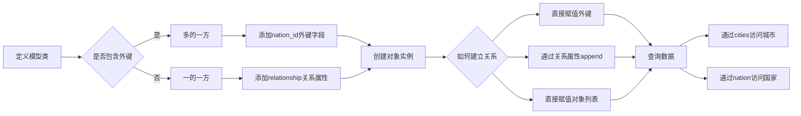

# SQLAlchemy一对多关系完整指南：模型定义、关系建立与数据操作

在数据库设计中，**一对多关系**是一种常见的关系类型。在这种关系中，"一"的一方可以关联到"多"的一方的多个记录，但"多"的一方只能关联到"一"的一方的一个记录。

例如，在城市和国家的模型中，一个国家可以有多个城市，但一个城市只能属于一个国家。在这种情况下，国家是"一"的一方，城市是"多"的一方。

在"一"类中添加一个关系属性作为**集合属性**。当调用这个属性时返回所有相关的对象。

比如城市和国家模型。

```python
# 定义City模型类，继承自db.Model
# 这个类映射到数据库中的city表
# 每个城市都属于一个国家，通过外键nation_id关联
class City(db.Model):
    """城市模型"""
    # 指定表名为'city'
    __tablename__ = 'city'
    # 定义id字段，整数类型，设为主键
    # 主键用于唯一标识每一条记录
    id = db.Column(db.Integer, primary_key=True)
    # 定义name字段，字符串类型，最大长度50，设置唯一约束
    # unique=True表示城市名称在数据库中不能重复
    name = db.Column(db.String(50), unique=True)
    
# 定义Nation模型类，继承自db.Model
# 这个类映射到数据库中的nation表
# 每个国家可以拥有多个城市
class Nation(db.Model):
    """国家模型"""
    # 指定表名为'nation'
    __tablename__ = 'nation'
    # 定义id字段，整数类型，设为主键
    # 主键用于唯一标识每一个国家
    id = db.Column(db.Integer, primary_key=True)
    # 定义nation_name字段，字符串类型，最大长度50，设置唯一约束
    # unique=True表示国家名称在数据库中不能重复
    nation_name = db.Column(db.String(50), unique=True)
```

需要实现一个国家对应多个城市。

#### 建立一对多关系

第一步: 

在"多"的一侧创建**外键**。

```python
# 定义City模型类，继承自db.Model
# 这个类映射到数据库中的city表
# 每个城市都属于一个国家，通过外键nation_id关联
class City(db.Model):
    """城市模型"""
    # 指定表名为'city'
    __tablename__ = 'city'
    # 定义id字段，整数类型，设为主键
    # 主键用于唯一标识每一条记录
    id = db.Column(db.Integer, primary_key=True)
    # 定义name字段，字符串类型，最大长度50，设置唯一约束
    # unique=True表示城市名称在数据库中不能重复
    name = db.Column(db.String(50), unique=True)
    # 外键指向nation表的id字段
    # db.ForeignKey('nation.id')指定外键约束，关联到nation表的id字段
    # 通过这个外键，建立了城市到国家的多对一关系
    nation_id = db.Column(db.Integer, db.ForeignKey('nation.id'))
    # 需要注意的是nation.id,表名是小写(因为SQLAlchemy生成的表默认为类名称的小写形式)
```

第二步:

在"一"的一侧定义关系属性。(集合关系属性,列表)

```python
# 定义Nation模型类，继承自db.Model
# 这个类映射到数据库中的nation表
# 每个国家可以拥有多个城市
class Nation(db.Model):
    """国家模型"""
    # 指定表名为'nation'
    __tablename__ = 'nation'
    # 定义id字段，整数类型，设为主键
    # 主键用于唯一标识每一个国家
    id = db.Column(db.Integer, primary_key=True)
    # 定义nation_name字段，字符串类型，最大长度50，设置唯一约束
    # unique=True表示国家名称在数据库中不能重复
    nation_name = db.Column(db.String(50), unique=True)
    # 定义一对多关系，一个国家可以有多个城市
    # 'City'指定关联的模型类
    # backref='nation'在City模型中自动创建nation属性，实现反向引用
    # 通过cities属性可以访问该国家的所有城市
    cities = db.relationship('City', backref='nation')
```

# 当关系属性`nation.cities`被调用时,**SQLAlchemy**会找到`city表`的**外键**字段(`nation_id`)。然后查询`city表`中`nation_id`为当前主键值(`nation.id`)的记录,返回包含这些记录的列表。

**需要注意的是**,使用关系函数定义的集合关系属性不是数据库字段,而是一个查询函数。所以返回值并不固定,而是根据查询结果动态变化。

#### **relationship**函数常用参数说明

`relationship`函数有许多参数可以用来定制关系的行为，以下是几个常用的参数：

1. **`backref`参数**：在一对多关系中，可以在"一"的一侧使用`backref`参数自动在"多"的一侧创建反向引用。

```python
# 定义Nation模型类，继承自db.Model
# 这个类映射到数据库中的nation表
class Nation(db.Model):
    """国家模型"""
    # 指定表名为'nation'
    __tablename__ = 'nation'
    # 定义id字段，整数类型，设为主键
    # 主键用于唯一标识每一个国家
    id = db.Column(db.Integer, primary_key=True)
    # 定义nation_name字段，字符串类型，最大长度50，设置唯一约束
    # unique=True表示国家名称在数据库中不能重复
    nation_name = db.Column(db.String(50), unique=True)
    # 使用backref参数创建双向关系
    # 'City'指定关联的模型类
    # backref='nation'在City模型中自动创建nation属性，实现反向引用
    # 通过cities属性可以访问该国家的所有城市
    cities = db.relationship('City', backref='nation')
```

这样，在`City`模型中就自动有了一个`nation`属性，可以直接访问该城市的所属国家。

2. **`lazy`参数**：控制关联对象的加载方式。

```python
# 定义Nation模型类，继承自db.Model
# 这个类映射到数据库中的nation表
class Nation(db.Model):
    """国家模型"""
    # 指定表名为'nation'
    __tablename__ = 'nation'
    # 定义id字段，整数类型，设为主键
    # 主键用于唯一标识每一个国家
    id = db.Column(db.Integer, primary_key=True)
    # 定义nation_name字段，字符串类型，最大长度50，设置唯一约束
    # unique=True表示国家名称在数据库中不能重复
    nation_name = db.Column(db.String(50), unique=True)
    # 使用lazy参数控制加载方式
    # 'City'指定关联的模型类
    # backref='nation'在City模型中自动创建nation属性，实现反向引用
    # lazy='select'指定加载方式为select模式（默认）
    # select模式会在访问cities属性时发出新的SELECT语句加载数据
    cities = db.relationship('City', backref='nation', lazy='select')
```

3. **`cascade`参数**：控制级联操作行为。

```python
# 定义Nation模型类，继承自db.Model
# 这个类映射到数据库中的nation表
class Nation(db.Model):
    """国家模型"""
    # 指定表名为'nation'
    __tablename__ = 'nation'
    # 定义id字段，整数类型，设为主键
    # 主键用于唯一标识每一个国家
    id = db.Column(db.Integer, primary_key=True)
    # 定义nation_name字段，字符串类型，最大长度50，设置唯一约束
    # unique=True表示国家名称在数据库中不能重复
    nation_name = db.Column(db.String(50), unique=True)
    # 使用cascade参数控制级联操作
    # 'City'指定关联的模型类
    # backref='nation'在City模型中自动创建nation属性，实现反向引用
    # cascade='all, delete-orphan'指定级联操作为全部操作，并删除孤儿对象
    # 当删除国家时，所有关联的城市也会被删除
    # 当城市不再关联到任何国家时，城市记录也会被删除
    cities = db.relationship('City', backref='nation', cascade='all, delete-orphan')
```

#### 创建和使用对象

创建国家和城市对象：

```python
# 创建国家对象，nation_name属性设置为'中国'
# 这会创建一个新的Nation实例，但尚未保存到数据库
china = Nation(nation_name='中国')
# 创建国家对象，nation_name属性设置为'美国'
# 这会创建另一个Nation实例，同样尚未保存到数据库
usa = Nation(nation_name='美国')

# 将china对象添加到数据库会话中
# db.session.add()将对象标记为待插入状态
# 此时对象还未真正写入数据库
# 只有在commit()之后才会真正保存到数据库
db.session.add(china)
# 将usa对象添加到数据库会话中
db.session.add(usa)
# 提交会话，将国家对象保存到数据库
# db.session.commit()会执行所有待处理的数据库操作
db.session.commit()

# 创建城市对象，name属性设置为'北京'，通过nation参数直接关联到china对象
# 在创建时直接建立与国家的关联关系
beijing = City(name='北京', nation=china)
# 创建城市对象，name属性设置为'上海'，通过nation参数直接关联到china对象
shanghai = City(name='上海', nation=china)
# 创建城市对象，name属性设置为'纽约'，通过nation参数直接关联到usa对象
new_york = City(name='纽约', nation=usa)

# 将beijing对象添加到数据库会话中
db.session.add(beijing)
# 将shanghai对象添加到数据库会话中
db.session.add(shanghai)
# 将new_york对象添加到数据库会话中
db.session.add(new_york)
# 提交会话，将城市对象保存到数据库
db.session.commit()
```

#### 查询关系数据

通过关系属性查询数据：

```python
# 通过Nation模型查询nation_name为'中国'的国家对象，返回第一个匹配的结果
# filter_by()方法用于筛选符合条件的记录
# first()方法返回查询结果的第一条记录，如果没有则返回None
china = Nation.query.filter_by(nation_name='中国').first()
# 打印国家名称
print(f"{china.nation_name}的城市有:")
# 遍历china对象的cities关系属性，获取所有关联的城市对象
# cities是由relationship定义的关系属性，返回一个城市对象列表
for city in china.cities:
    # 打印城市名称
    print(f"- {city.name}")

# 通过City模型查询name为'北京'的城市对象，返回第一个匹配的结果
beijing = City.query.filter_by(name='北京').first()
# 通过beijing对象的nation属性（由backref自动创建）获取关联的国家对象，并打印信息
# nation属性是由backref='nation'自动创建的反向引用属性
print(f"{beijing.name}属于{beijing.nation.nation_name}")
```

#### 建立关系

1.直接通过**外键**字段赋值。

```python
# 直接为city对象的nation_id外键字段赋值，关联到ID为1的国家
# 这是最直接的方式，通过设置外键字段的值来建立关系
city.nation_id = 1
# 提交会话，保存更改到数据库
db.session.commit()
```

2.通过关系属性添加

```python
# 通过nation对象的cities关系属性添加beijing城市对象到城市列表中
# append()方法会将beijing对象添加到关联的城市列表中
# 同时会自动设置beijing对象的nation_id外键字段
nation.cities.append(beijing)
# beijing为City对象
# 提交会话，保存更改到数据库
db.session.commit()
```

3.直接将一个**对象列表**赋值给关系属性

```python
# 直接将包含beijing和shanghai对象的列表赋值给nation对象的cities关系属性
# 这种方式会替换原有的所有关联关系
# 如果原来有关联的城市，会被移除；如果beijing或shanghai原来关联到其他国家，也会被断开
nation.cities = [beijing, shanghai]
# beijing和shanghai均为对象
# 提交会话，保存更改到数据库
db.session.commit()
```

---

#### 建立双向关系

通过在`relationship`中使用`backref`参数，我们已经建立了双向关系：

```python
# 定义Nation模型类，继承自db.Model
# 这个类映射到数据库中的nation表
class Nation(db.Model):
    """国家模型"""
    # 指定表名为'nation'
    __tablename__ = 'nation'
    # 定义id字段，整数类型，设为主键
    id = db.Column(db.Integer, primary_key=True)
    # 定义nation_name字段，字符串类型，最大长度50，设置唯一约束
    nation_name = db.Column(db.String(50), unique=True)
    # 定义一对多关系，backref参数自动在City模型中创建nation属性
    # 'City'指定关联的模型类
    # backref='nation'在City模型中自动创建nation属性，实现反向引用
    # 通过cities属性可以访问该国家的所有城市
cities = db.relationship('City', backref='nation')

# 定义City模型类，继承自db.Model
# 这个类映射到数据库中的city表
class City(db.Model):
    """城市模型"""
    # 指定表名为'city'
    __tablename__ = 'city'
    # 定义id字段，整数类型，设为主键
    id = db.Column(db.Integer, primary_key=True)
    # 定义name字段，字符串类型，最大长度50，设置唯一约束
    name = db.Column(db.String(50), unique=True)
    # 外键指向nation表的id字段
    # db.ForeignKey('nation.id')指定外键约束，关联到nation表的id字段
    # 通过这个外键，建立了城市到国家的多对一关系
    nation_id = db.Column(db.Integer, db.ForeignKey('nation.id'))
```

这样就建立了双向关系：
- 通过`nation.cities`可以获取该国家的所有城市
- 通过`city.nation`可以获取该城市所属的国家

下面是一对多关系操作的流程图：



使用示例：

```python
# 通过Nation模型查询nation_name为'中国'的国家对象，返回第一个匹配的结果
# filter_by()方法用于筛选符合条件的记录
# first()方法返回查询结果的第一条记录，如果没有则返回None
china = Nation.query.filter_by(nation_name='中国').first()
# 打印国家名称
print(f"{china.nation_name}的城市有:")
# 遍历china对象的cities关系属性，获取所有关联的城市对象
# cities是由relationship定义的关系属性，返回一个城市对象列表
for city in china.cities:
    # 打印城市名称
    print(f"- {city.name}")

# 通过City模型查询name为'北京'的城市对象，返回第一个匹配的结果
beijing = City.query.filter_by(name='北京').first()
# 通过beijing对象的nation属性（由backref自动创建）获取关联的国家对象，并打印信息
# nation属性是由backref='nation'自动创建的反向引用属性
print(f"{beijing.name}属于{beijing.nation.nation_name}")
```

## 核心要点总结

- **一对多关系**："一"的一方可以关联"多"的一方的多个记录，"多"的一方只能关联"一"的一方的一个记录，这是数据库设计中最常见的关系类型之一
- **外键**：在"多"的一侧创建，指向"一"的一侧的主键，通过外键约束建立数据关联，确保数据完整性
- **relationship函数**：在"一"的一侧定义，用于建立对象间的关系，这是一个查询函数而非数据库字段，返回值根据查询结果动态变化
- **backref参数**：**最佳实践**，自动在"多"的一侧创建反向引用，实现双向关系访问，简化代码编写
- **lazy参数**：**最佳实践**，控制关联对象加载方式，包括select、joined、subquery、dynamic等模式，可根据性能需求选择合适的加载策略
- **cascade参数**：**最佳实践**，控制级联操作行为，如save-update、delete、all、delete-orphan等，确保数据一致性和完整性
- **关系建立方式**：可以通过直接赋值外键字段、通过关系属性append方法、或直接赋值对象列表三种方式建立一对多关系
- **数据查询**：通过关系属性可以方便地访问关联数据，支持正向查询（从一到多）和反向查询（从多到一）