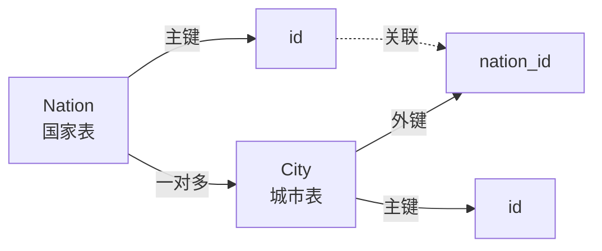
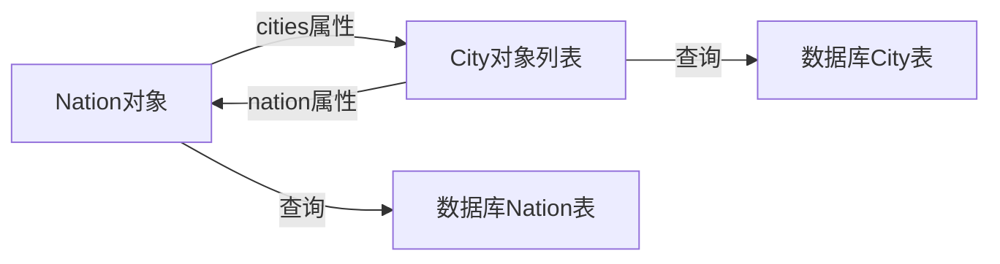

# SQLAlchemy一对多关系详解与实现

在数据库设计中，<font color=red>一对多关系</font>是一种常见的关系类型。在这种关系中，"<font color=blue>一</font>"的一方可以关联到"<font color=blue>多</font>"的一方的多个记录，但"<font color=blue>多</font>"的一方只能关联到"<font color=blue>一</font>"的一方的一个记录。

例如，在城市和国家的模型中，一个国家可以有多个城市，但一个城市只能属于一个国家。在这种情况下，国家是"<font color=blue>一</font>"的一方，城市是"<font color=blue>多</font>"的一方。

在"<font color=blue>一</font>"类中添加一个关系属性作为<font color=blue>集合属性</font>。当调用这个属性时返回所有相关的对象。

比如城市和国家模型。

```python
# 定义City模型类，继承自db.Model
class City(db.Model):
    """城市模型"""
    # 指定表名为'city'
    __tablename__ = 'city'
    # 定义id字段，整数类型，设为主键
    id = db.Column(db.Integer, primary_key=True)
    # 定义name字段，字符串类型，最大长度50，设置唯一约束
    name = db.Column(db.String(50), unique=True)
    
# 定义Nation模型类，继承自db.Model
class Nation(db.Model):
    """国家模型"""
    # 指定表名为'nation'
    __tablename__ = 'nation'
    # 定义id字段，整数类型，设为主键
    id = db.Column(db.Integer, primary_key=True)
    # 定义nation_name字段，字符串类型，最大长度50，设置唯一约束
    nation_name = db.Column(db.String(50), unique=True)
```

需要实现一个国家对应多个城市。

#### 建立一对多关系

第一步: 

在"<font color=blue>多</font>"的一侧创建<font color=red>外键</font>。

```python
# 定义City模型类，继承自db.Model
class City(db.Model):
    """城市模型"""
    # 指定表名为'city'
    __tablename__ = 'city'
    # 定义id字段，整数类型，设为主键
    id = db.Column(db.Integer, primary_key=True)
    # 定义name字段，字符串类型，最大长度50，设置唯一约束
    name = db.Column(db.String(50), unique=True)
    # 外键指向nation表的id字段
    # db.ForeignKey('nation.id')指定外键约束，关联到nation表的id字段
    nation_id = db.Column(db.Integer, db.ForeignKey('nation.id'))
    # 需要注意的是nation.id,表名是小写(因为SQLAlchemy生成的表默认为类名称的小写形式)
```

第二步:

在"<font color=blue>一</font>"的一侧定义关系属性。(集合关系属性,列表)

```python
# 定义Nation模型类，继承自db.Model
class Nation(db.Model):
    """国家模型"""
    # 指定表名为'nation'
    __tablename__ = 'nation'
    # 定义id字段，整数类型，设为主键
    id = db.Column(db.Integer, primary_key=True)
    # 定义nation_name字段，字符串类型，最大长度50，设置唯一约束
    nation_name = db.Column(db.String(50), unique=True)
    # 定义一对多关系，一个国家可以有多个城市
    # 'City'指定关联的模型类
    # backref='nation'在City模型中自动创建nation属性，实现反向引用
    cities = db.relationship('City', backref='nation')
```

当关系属性`nation.cities`被调用时,<font color=red>SQLAlchemy</font>会找到`city表`的<font color=red>外键</font>字段(`nation_id`)。然后查询`city表`中`nation_id`为当前主键值(`nation.id`)的记录,返回包含这些记录的列表。

**需要注意的是**,使用关系函数定义的集合关系属性不是数据库字段,而是一个查询函数。所以返回值并不固定,而是根据查询结果动态变化。

#### 一对多关系结构图



#### <font color=red>relationship</font>函数常用参数说明

`relationship`函数有许多参数可以用来定制关系的行为，以下是几个常用的参数：

1. **`backref`参数**：在一对多关系中，可以在"<font color=blue>一</font>"的一侧使用`backref`参数自动在"<font color=blue>多</font>"的一侧创建反向引用。

```python
# 定义Nation模型类，继承自db.Model
class Nation(db.Model):
    """国家模型"""
    # 指定表名为'nation'
    __tablename__ = 'nation'
    # 定义id字段，整数类型，设为主键
    id = db.Column(db.Integer, primary_key=True)
    # 定义nation_name字段，字符串类型，最大长度50，设置唯一约束
    nation_name = db.Column(db.String(50), unique=True)
    # 使用backref参数创建双向关系
    # 'City'指定关联的模型类
    # backref='nation'在City模型中自动创建nation属性，实现反向引用
    cities = db.relationship('City', backref='nation')
```

这样，在`City`模型中就自动有了一个`nation`属性，可以直接访问该城市的所属国家。

2. **`lazy`参数**：控制关联对象的加载方式。
   - `select`（默认值）：在访问属性时发出新的SELECT语句加载数据
   - `joined`：使用JOIN语句加载数据
   - `subquery`：使用子查询加载数据
   - `dynamic`：返回一个查询对象，允许进一步过滤

```python
# 定义Nation模型类，继承自db.Model
class Nation(db.Model):
    """国家模型"""
    # 指定表名为'nation'
    __tablename__ = 'nation'
    # 定义id字段，整数类型，设为主键
    id = db.Column(db.Integer, primary_key=True)
    # 定义nation_name字段，字符串类型，最大长度50，设置唯一约束
    nation_name = db.Column(db.String(50), unique=True)
    # 使用lazy参数控制加载方式
    # 'City'指定关联的模型类
    # backref='nation'在City模型中自动创建nation属性，实现反向引用
    # lazy='select'指定加载方式为select模式（默认）
    cities = db.relationship('City', backref='nation', lazy='select')
```

3. **`cascade`参数**：控制级联操作行为。
   - `save-update`：默认选项，保存或更新父对象时也会保存或更新子对象
   - `delete`：删除父对象时也删除子对象
   - `all`：应用所有级联选项
   - `delete-orphan`：删除孤立对象（当子对象不再关联到父对象时）

```python
# 定义Nation模型类，继承自db.Model
class Nation(db.Model):
    """国家模型"""
    # 指定表名为'nation'
    __tablename__ = 'nation'
    # 定义id字段，整数类型，设为主键
    id = db.Column(db.Integer, primary_key=True)
    # 定义nation_name字段，字符串类型，最大长度50，设置唯一约束
    nation_name = db.Column(db.String(50), unique=True)
    # 使用cascade参数控制级联操作
    # 'City'指定关联的模型类
    # backref='nation'在City模型中自动创建nation属性，实现反向引用
    # cascade='all, delete-orphan'指定级联操作为全部操作，并删除孤儿对象
    cities = db.relationship('City', backref='nation', cascade='all, delete-orphan')
```

#### 创建和使用对象

创建国家和城市对象：

```python
# 创建国家对象，nation_name属性设置为'中国'
china = Nation(nation_name='中国')
# 创建国家对象，nation_name属性设置为'美国'
usa = Nation(nation_name='美国')

# 将china对象添加到数据库会话中
db.session.add(china)
# 将usa对象添加到数据库会话中
db.session.add(usa)
# 提交会话，将国家对象保存到数据库
db.session.commit()

# 创建城市对象，name属性设置为'北京'，通过nation参数直接关联到china对象
beijing = City(name='北京', nation=china)
# 创建城市对象，name属性设置为'上海'，通过nation参数直接关联到china对象
shanghai = City(name='上海', nation=china)
# 创建城市对象，name属性设置为'纽约'，通过nation参数直接关联到usa对象
new_york = City(name='纽约', nation=usa)

# 将beijing对象添加到数据库会话中
db.session.add(beijing)
# 将shanghai对象添加到数据库会话中
db.session.add(shanghai)
# 将new_york对象添加到数据库会话中
db.session.add(new_york)
# 提交会话，将城市对象保存到数据库
db.session.commit()
```

#### 查询关系数据

通过关系属性查询数据：

```python
# 通过Nation模型查询nation_name为'中国'的国家对象，返回第一个匹配的结果
china = Nation.query.filter_by(nation_name='中国').first()
# 打印国家名称
print(f"{china.nation_name}的城市有:")
# 遍历china对象的cities关系属性，获取所有关联的城市对象
for city in china.cities:
    # 打印城市名称
    print(f"- {city.name}")

# 通过City模型查询name为'北京'的城市对象，返回第一个匹配的结果
beijing = City.query.filter_by(name='北京').first()
# 通过beijing对象的nation属性（由backref自动创建）获取关联的国家对象，并打印信息
print(f"{beijing.name}属于{beijing.nation.nation_name}")
```

#### 建立关系

1.直接通过<font color=red>外键</font>字段赋值。

```python
# 直接为city对象的nation_id外键字段赋值，关联到ID为1的国家
city.nation_id = 1
# 提交会话，保存更改到数据库
db.session.commit()
```

2.通过关系属性添加

```python
# 通过nation对象的cities关系属性添加beijing城市对象到城市列表中
nation.cities.append(beijing)
# beijing为City对象
# 提交会话，保存更改到数据库
db.session.commit()
```

3.直接将一个<font color=red>对象列表</font>赋值给关系属性

```python
# 直接将包含beijing和shanghai对象的列表赋值给nation对象的cities关系属性
nation.cities = [beijing, shanghai]
# beijing和shanghai均为对象
# 提交会话，保存更改到数据库
db.session.commit()
```

---

#### 建立双向关系

通过在`relationship`中使用`backref`参数，我们已经建立了双向关系：

```python
# 定义Nation模型类，继承自db.Model
class Nation(db.Model):
    """国家模型"""
    # 指定表名为'nation'
    __tablename__ = 'nation'
    # 定义id字段，整数类型，设为主键
    id = db.Column(db.Integer, primary_key=True)
    # 定义nation_name字段，字符串类型，最大长度50，设置唯一约束
    nation_name = db.Column(db.String(50), unique=True)
    # 定义一对多关系，backref参数自动在City模型中创建nation属性
    # 'City'指定关联的模型类
    # backref='nation'在City模型中自动创建nation属性，实现反向引用
    cities = db.relationship('City', backref='nation')

# 定义City模型类，继承自db.Model
class City(db.Model):
    """城市模型"""
    # 指定表名为'city'
    __tablename__ = 'city'
    # 定义id字段，整数类型，设为主键
    id = db.Column(db.Integer, primary_key=True)
    # 定义name字段，字符串类型，最大长度50，设置唯一约束
    name = db.Column(db.String(50), unique=True)
    # 外键指向nation表的id字段
    # db.ForeignKey('nation.id')指定外键约束，关联到nation表的id字段
    nation_id = db.Column(db.Integer, db.ForeignKey('nation.id'))
```

这样就建立了双向关系：
- 通过`nation.cities`可以获取该国家的所有城市
- 通过`city.nation`可以获取该城市所属的国家

使用示例：

```python
# 通过Nation模型查询nation_name为'中国'的国家对象，返回第一个匹配的结果
china = Nation.query.filter_by(nation_name='中国').first()
# 打印国家名称
print(f"{china.nation_name}的城市有:")
# 遍历china对象的cities关系属性，获取所有关联的城市对象
for city in china.cities:
    # 打印城市名称
    print(f"- {city.name}")

# 通过City模型查询name为'北京'的城市对象，返回第一个匹配的结果
beijing = City.query.filter_by(name='北京').first()
# 通过beijing对象的nation属性（由backref自动创建）获取关联的国家对象，并打印信息
print(f"{beijing.name}属于{beijing.nation.nation_name}")
```

#### 双向关系访问流程图



## 核心要点总结

- **<font color=red>一对多关系</font>**：<font color=blue>一</font>的一方可以关联<font color=blue>多</font>的一方的多个记录，<font color=blue>多</font>的一方只能关联<font color=blue>一</font>的一方的一个记录
- **<font color=red>外键</font>**：在<font color=blue>多</font>的一侧创建，指向<font color=blue>一</font>的一侧的主键，建立数据关联
- **<font color=red>relationship函数</font>**：在<font color=blue>一</font>的一侧定义，用于建立对象间的关系，非数据库字段
- **<font color=blue>backref参数</font>**：<font color=orange>最佳实践</font>，自动在<font color=blue>多</font>的一侧创建反向引用，实现双向关系
- **<font color=blue>lazy参数</font>**：<font color=orange>最佳实践</font>，控制关联对象加载方式，优化查询性能
- **<font color=blue>cascade参数</font>**：<font color=orange>最佳实践</font>，控制级联操作行为，确保数据一致性