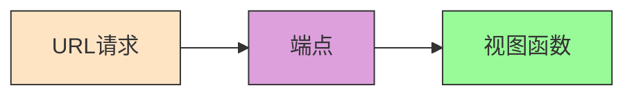
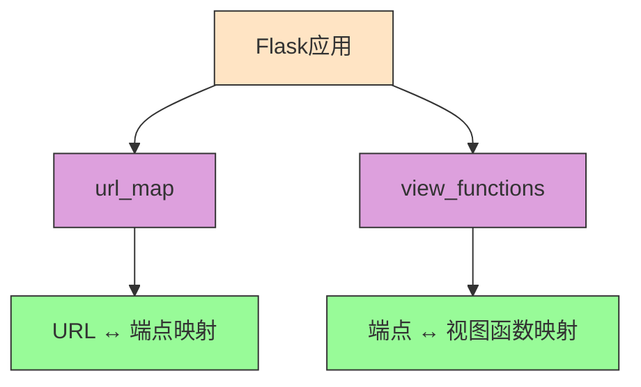
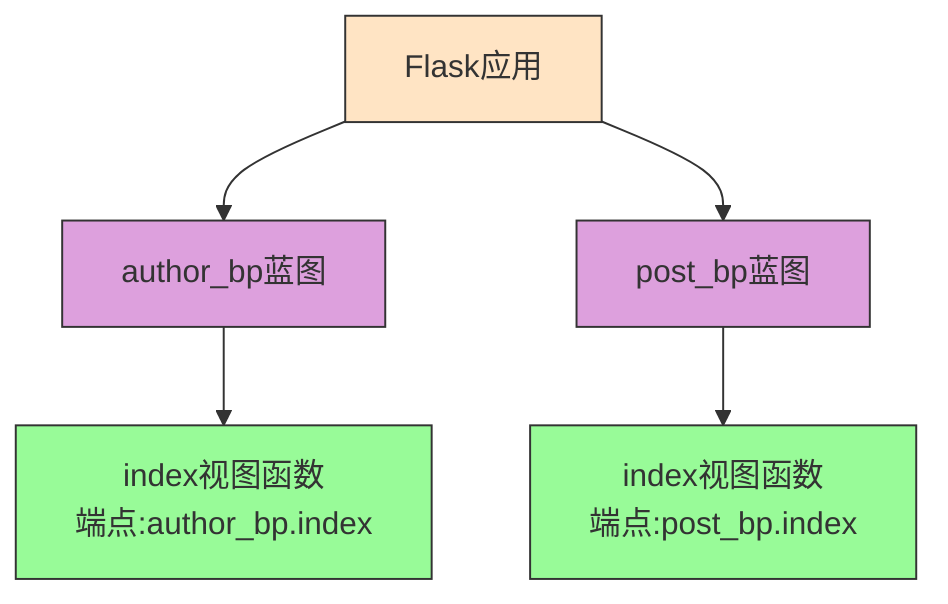
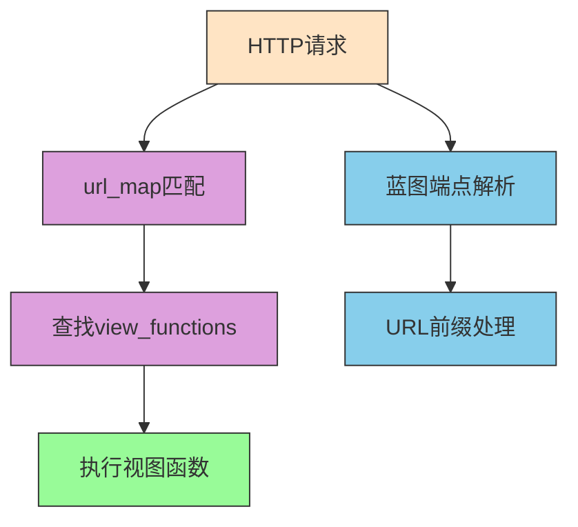

## 端点(endpoint)

端点(<font color=red>**Endpoint**</font>)是<font color=blue>**URL规则**</font>(rule)和<font color=blue>**视图函数**</font>(view_func)的中间媒介。它是Flask路由系统的核心概念，用于解耦URL与视图函数之间的直接绑定关系，提供更大的灵活性和可扩展性。




比如

```python
# 使用装饰器方式定义路由
# @app.route()装饰器是Flask提供的便捷方式，用于将URL规则与视图函数关联
@app.route('/index')
def index():
  # 视图函数返回简单的问候语
  return 'hello,world'

# 等效于使用add_url_rule方法手动添加URL规则
# 这种方式更直观地展示了Flask路由系统的底层实现机制
def index():
  # 视图函数返回简单的问候语
  return 'hello,world'
# add_url_rule(rule, endpoint, view_func)方法参数说明：
# rule: URL路径规则，定义了访问该视图函数的URL路径
# endpoint: 端点名称，默认为视图函数名，用于唯一标识视图函数
# view_func: 处理该URL的视图函数，负责生成HTTP响应
app.add_url_rule('/index', 'index', index)
```

默认情况下,<font color=red>**端点(Endpoint)**</font>是<font color=blue>**视图函数(View Function)**</font>的名字。这种设计使得Flask可以通过端点名称唯一标识每个视图函数，无论它们位于哪个模块或蓝图中。

开发者也可以显式地更改端点名称，以满足特定的命名需求或避免命名冲突。

```python
# 显式指定端点名称为'index2'，而不是使用默认的函数名
# 通过endpoint参数可以自定义端点名称，用于解决命名冲突或满足特定需求
@app.route('/', endpoint='index2')
def index():
  # 视图函数的具体实现
  pass
```

---

## 端点,view_functions,url_map

在每个Flask应用程序对象(app)中都有两个重要的属性与端点机制相关：

在<font color=red>**view_functions**</font>中存储着`端点名称(endpoint) → 视图函数(view_func)`的键值对映射关系。

在<font color=red>**url_map**</font>中存储着<font color=blue>**URL规则**</font>和<font color=red>**端点名称**</font>的映射关系。

这两个核心数据结构均由`add_url_rule`方法进行维护和更新，构成了Flask路由系统的基础架构。

```python
# 导入Flask类
from flask import Flask

# 创建Flask应用实例
app = Flask(__name__)

# 定义根路径的视图函数
# 该路由将'/'路径映射到index视图函数，端点名称默认为'index'
@app.route('/')
def index():
    # 返回简单的文本响应
    return 'index'

# 定义/hello路径的视图函数
# 该路由将'/hello'路径映射到hello视图函数，端点名称默认为'hello'
@app.route('/hello')
def hello():
    # 返回简单的文本响应
    return 'hello'

# 应用启动入口
if __name__ == '__main__':
    # 打印view_functions字典，显示端点与视图函数的映射关系
    # 格式：{'端点名称': 视图函数对象}
    print('View Functions:')
    print(app.view_functions)
    print('------------')
    # 打印url_map对象，显示URL规则与端点的映射关系
    # 格式：Map([Rule对象列表])，每个Rule对象包含URL规则和对应的端点
    print('URL Map:')
    print(app.url_map)
    # 启动Flask开发服务器
    app.run(host='localhost', port=5004)
```

输出:

```python
{'static': <bound method _PackageBoundObject.send_static_file of <Flask 'test'>>, 
 'index': <function index at 0x104db2310>, 'hello': <function hello at 0x105ae4160>}
------------
Map([<Rule '/hello' (HEAD, GET, OPTIONS) -> hello>,
 <Rule '/' (HEAD, GET, OPTIONS) -> index>,
 <Rule '/static/<filename>' (HEAD, GET, OPTIONS) -> static>])
```

所以当一个HTTP请求进入时，Flask会按照以下流程处理：

1. 首先通过URL规则(Rule)在<font color=red>**url_map**</font>中查找对应的端点名称(endpoint)
2. 然后根据端点名称在<font color=red>**view_functions**</font>中查找对应的视图函数(view_func)
3. 最终执行找到的视图函数并返回响应结果

这种两阶段查找机制解耦了URL与视图函数之间的直接绑定关系，提供了更大的灵活性。



这个图表清晰地展示了Flask路由系统的核心工作机制：

1. <font color=red>**url_map**</font>负责维护URL规则与端点名称之间的映射关系
2. <font color=red>**view_functions**</font>负责维护端点名称与视图函数之间的映射关系
3. 通过这两层映射关系，实现了URL与视图函数的解耦

---

## 蓝图和端点

当使用<font color=red>**蓝图**</font>时,<font color=blue>**端点**</font>会变成`'<font color=orange>**蓝图名.视图函数名**</font>'`.

<font color=red>**蓝图(Blueprint)**</font>是Flask提供的一个重要特性，它可以将一系列相关的操作组织成一个集合，实现应用的模块化设计。通过蓝图，我们可以将大型应用拆分成多个小的、可重用的组件。<font color=orange>**建议在命名蓝图时添加_bp后缀**</font>，以提高代码可读性和维护性。

<font color=orange>**最佳实践**</font>：一般情况下，建议在蓝图对象名称后添加`_bp`后缀，例如`user_bp`、`admin_bp`，这样可以在代码中快速识别出哪些是蓝图对象，提高代码可读性和维护性。

蓝图搭配端点的设计，解释了<font color=blue>为什么Flask要引入端点机制，而不是直接将URL规则映射到视图函数。</font>

蓝图搭配端点，可以实现蓝图的视图函数命名空间(namespace)，有效解决不同模块间视图函数名称冲突的问题。<font color=orange>**这是Flask模块化设计的重要最佳实践**</font>。

比如在author_bp蓝图和post_bp蓝图中都注册了一个名为index的视图函数。当在模板中使用`url_for('index')`获取URL时会产生命名冲突，因为Flask无法确定应该使用哪个蓝图下的index视图函数。<font color=orange>**使用完整的端点名称可以解决这个问题**</font>。

而通过`url_for('author_bp.index')`和`url_for('post_bp.index')`这种方式，能够明确指定使用哪个蓝图下的视图函数，有效避免冲突并解决视图函数的重名问题。<font color=orange>**这是处理蓝图中同名视图函数的标准方法**</font>。



这个图表展示了蓝图如何通过命名空间机制解决视图函数重名问题：

1. <font color=red>**命名空间隔离**</font>：不同蓝图下的同名视图函数通过`蓝图名.视图函数名`的方式获得唯一的端点名称
2. <font color=red>**明确引用**</font>：在使用`url_for()`函数时，可以通过完整的端点名称明确指定要引用的视图函数

---

## 蓝图和url_prefix

通过上一小节的蓝图端点命名机制，可以有效避免因视图函数名称重复而导致的端点名称冲突问题。<font color=orange>**但在实际应用中还需要考虑URL路径冲突的情况**</font>。

但是如果url也一样该怎么办呢?

比如author_bp和post_bp均注册了相同的url

```python
# 在author蓝图中定义根路径视图函数
# 该视图函数在author_bp蓝图中注册，端点名称将自动变为'author_bp.index'
@author_bp.route('/')
def index():
  # 返回author相关的页面内容
  return 'index'

# 在post蓝图中也存在相同的路由，这会导致URL冲突问题
# 该视图函数在post_bp蓝图中注册，端点名称将自动变为'post_bp.index'
# 虽然端点名称不会冲突，但如果不在注册时添加url_prefix，URL路径会冲突
@post_bp.route('/')
def index():
  # 返回post相关的页面内容
  return 'post'
```

如上所示，当两个蓝图都注册了相同的URL路径时，会出现URL冲突问题。虽然端点名称通过蓝图前缀避免了重名，但URL路径本身仍然会发生冲突。<font color=orange>**使用url_prefix是解决这一问题的标准方案**</font>。

为了避免这种情况,<font color=orange>**最佳实践是在注册蓝图时填入url_prefix参数**</font>,

```python
# 创建Flask应用实例
app = Flask(__name__)

# 注册author蓝图，并添加URL前缀'/author'
# 这样author蓝图中的所有路由都会加上'/author'前缀
# 例如：@author_bp.route('/')会变成'/author/'路径
app.register_blueprint(author_bp, url_prefix='/author')

# 注册post蓝图，并添加URL前缀'/post'
# 这样post蓝图中的所有路由都会加上'/post'前缀
# 例如：@post_bp.route('/')会变成'/post/'路径
app.register_blueprint(post_bp, url_prefix='/post')
```

通过添加URL前缀后，两者的实际访问URL变成了：

```python
# author蓝图的根路径URL
/author/
# post蓝图的根路径URL
/post/
```

这样就成功解决了URL路径冲突的问题，同时保持了端点命名的清晰性。<font color=orange>**这是Flask蓝图设计中处理URL冲突的标准方法**</font>。

---

### 总结:

1. <font color=red>**Flask请求处理流程**</font>：<font color=blue>HTTP请求进入 → url_map匹配(URL规则与端点映射) → view_functions查找(端点与视图函数对应) → 执行视图函数并返回响应</font>。
2. <font color=red>**蓝图端点命名机制**</font>：<font color=blue>使用"`蓝图名.视图函数名`"的方式解决了不同蓝图间视图函数重名问题，扩展了视图函数命名空间</font>。
3. <font color=red>**URL前缀机制**</font>：<font color=blue>注册蓝图时填入`url_prefix`参数，解决了不同蓝图间URL路径冲突的问题，实现URL的层次化管理</font>。
4. <font color=red>**命名规范建议**</font>：<font color=orange>推荐在命名蓝图时添加`_bp`后缀，提高代码可读性和识别度</font>。



这个流程图展示了Flask处理HTTP请求的完整过程，包括蓝图端点解析和URL前缀处理等关键步骤。

---

## 核心要点总结

1. <font color=red>**端点(Endpoint)机制**</font>：<font color=blue>端点是连接URL规则和视图函数的桥梁，默认情况下端点名就是视图函数名</font>。<font color=orange>这种设计解耦了URL与视图函数的直接绑定关系</font>。

2. <font color=red>**Flask路由核心数据结构**</font>：<font color=blue>Flask应用通过url_map存储URL规则与端点的映射关系，通过view_functions存储端点与视图函数的对应关系</font>。

3. <font color=red>**蓝图端点命名空间**</font>：<font color=blue>使用蓝图(Blueprint)时，端点会自动加上蓝图名前缀(`蓝图名.视图函数名`)</font>，<font color=orange>有效避免不同蓝图间视图函数重名问题</font>。

4. <font color=red>**URL前缀管理**</font>：<font color=orange>注册蓝图时使用url_prefix参数可以解决不同蓝图间URL路径冲突的问题，实现URL的层次化管理</font>。

5. <font color=red>**请求处理完整流程**</font>：<font color=blue>HTTP请求进入 → url_map匹配(URL规则与端点映射) → view_functions查找(端点与视图函数对应) → 执行视图函数并返回响应</font>。

6. <font color=red>**蓝图命名规范**</font>：<font color=orange>推荐为蓝图对象命名时添加_bp后缀（如user_bp），提高代码可读性和识别度</font>。

7. <font color=red>**URL规则添加方式**</font>：<font color=blue>可以通过app.add_url_rule(rule, endpoint, view_func)显式地添加URL规则，这是装饰器@app.route()的底层实现方式</font>。
