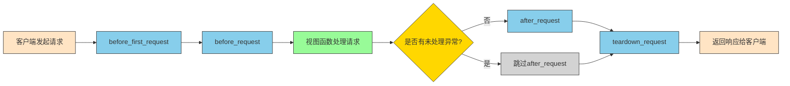

title: Flask请求钩子完全指南：从基础概念到实际应用

所谓**请求钩子**,就是在客户端与服务器交互的过程中统一处理`准备工作`或者`扫尾工作`.

### APP层的请求钩子

常见的请求钩子

- <font color=red>before_first_request</font>：在处理第一个请求前运行。
- <font color=red>before_request</font>：在每次请求前运行。
- <font color=red>after_request</font>：~~如果没有未处理的异常抛出，~~在每次请求后运行。
- <font color=red>teardown_request</font>：在每次请求后运行，即使有未处理的异常抛出。

```python
# 从flask框架导入Flask类、url_for函数和redirect函数
# Flask是主要的应用类，用于创建Web应用实例
# url_for用于生成URL，redirect用于重定向
from flask import Flask, url_for, redirect

# 创建Flask应用实例，__name__表示当前模块名称
# __name__作为参数传递给Flask构造函数，用于确定应用的根路径和调试模式等
app = Flask(__name__)

# 定义路由/index，当访问该路径时会触发index函数
@app.route('/index')
def index():
    # 故意制造除零异常，用于测试异常处理
    a = 1 / 0
    # 返回响应内容
    return 'run index'

# 定义路由/hello，当访问该路径时会触发hello函数
@app.route('/hello')
def hello():
    # 返回简单的问候语
    return 'hello'

# 注册before_first_request钩子，在处理第一个请求前运行
# 该钩子函数只会在应用启动后接收到的第一个请求前执行一次
# 通常用于初始化操作，如加载配置、建立数据库连接等
@app.before_first_request
def b_f_r():
    # 打印提示信息，表示第一个请求前的准备工作
    # 这里只是简单打印信息，实际应用中可能会进行更复杂的初始化
    print('before_first_request')

# 注册before_request钩子，在每次请求前运行
@app.before_request
def b_r():
    # 打印提示信息，表示每次请求前的准备工作
    print('before_request')

# 定义路由/handel_request，当访问该路径时会触发handel_request函数
@app.route('/handel_request')
def handel_request():
    # 打印处理请求的信息
    print('处理请求')
    # 打印重定向信息
    print('重定向到/h路径,测试404界面')
    # 重定向到不存在的/h路径，用于测试404页面
    return redirect('/h')

# 注册after_request钩子，在每次请求后运行（除非有未处理的异常）
# 接收response参数，表示HTTP响应对象
# 该钩子用于在视图函数处理完请求后，返回响应给客户端前进行最后的处理
@app.after_request
def a_r(response):
    # 打印提示信息，表示请求后的处理工作
    print('after_request')
    # 必须返回response对象，可以是原始响应或修改后的响应
    # 可以在此处修改响应头、压缩响应内容等
    return response

# 注册teardown_request钩子，在每次请求后运行，即使有未处理的异常也会执行
# 接收exception参数，记录请求处理过程中的异常信息
# 无论请求处理成功与否，该钩子都会执行，用于资源清理工作
@app.teardown_request
def t_r(exception):
    # 打印提示信息，表示请求结束后的清理工作
    print('teardown_request')
    # 打印分隔线，标识请求处理流程结束
    print('======请求结束=======')
    # 可以选择返回响应对象，通常不需要
    # 实际应用中，这里常用于关闭数据库连接、释放文件锁等资源清理操作
    return exception

# 程序入口点，当直接运行此脚本时执行
if __name__ == '__main__':
    # 启动Flask开发服务器，监听本地5006端口
    app.run(host='localhost', port=5006)
```

输出如下

```python
before_first_request
before_request
处理请求
重定向到/h路径,测试404界面
after_request
teardown_request
======请求结束======
127.0.0.1 - - [05/Nov/2020 10:20:05] "GET /handel_request HTTP/1.1" 302 -
127.0.0.1 - - [05/Nov/2020 10:20:05] "GET /h HTTP/1.1" 404 -
before_request
after_request
teardown_request
======请求结束======
```

#### Flask请求钩子执行流程图

下面的流程图展示了Flask请求钩子的执行顺序和条件：



值得注意的是**after_request**在**Flask 0.7**版本以下会因为bug导致遇到未处理的异常时不会运行.

网上很多文章指出这个问题但没有标注版本.

这个bug在0.7版本中已经修复.[isseu](https://github.com/pallets/flask/issues/174)

下面是文档介绍:

>after_request(**args*, ***kwargs*)
>
>Register a function to be run after each request. Your function must take one parameter, a [`response_class`](http://docs.jinkan.org/docs/flask/api.html#flask.Flask.response_class) object and return a new response object or the same (see [`process_response()`](http://docs.jinkan.org/docs/flask/api.html#flask.Flask.process_response)).
>
>As of Flask 0.7 this function might not be executed at the end of the request in case an unhandled exception occurred.

---

Note:可能是as of Flask 0.7 这里让大家理解出错. as of 既有截止的意思,也有从...时开始的意思.

通过在handel_request函数中加入`4/0`错误,发现after_request依旧正常执行,可以确认as of在这里是截止的意思.

---

既然after_request和teardown_request都是在请求结束后扫尾,那他们有什么不同呢?

根据文档可知:

1. **after_request**必须传入一个**response对象**,必须返回一个**response对象**.
2. **after_request**一般用来统一修改响应的内容，比如**修改响应头**.
3. **teardown_request**需要传入一个参数记录异常,如果需要可以将这个异常返回.
4. **teardown_request**一般用来**释放程序占用的资源**,比如释放数据库连接.

---

### 蓝图层的请求钩子

和app层类似,蓝图层的常用钩子如下:

before_app_request,

after_app_request,

teardown_app_request.

> Such a function is executed after each request, even if outside of the blueprint.

## 核心要点总结

1. **请求钩子**是在客户端与服务器交互过程中处理准备工作或扫尾工作的机制
2. **before_first_request**仅在处理第一个请求前运行一次，常用于初始化操作
3. **before_request**在每次请求前都会运行，可用于权限检查、日志记录等
4. **after_request**在每次请求后运行（除非有未处理的异常），主要用于修改响应内容
5. **teardown_request**在每次请求后运行，即使出现未处理的异常，用于资源清理
6. **after_request**与**teardown_request**的主要区别在于用途：前者用于修改响应内容，后者用于释放资源
7. 在**Flask 0.7**版本以下，**after_request**遇到未处理异常时可能不会执行
8. 蓝图层也提供了类似的钩子函数：**before_app_request**、**after_app_request**、**teardown_app_request**

