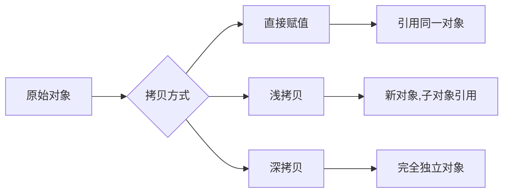

title: Python 拷贝机制详解：直接赋值、浅拷贝与深拷贝的原理与应用

Date: 2020/10/19 21:31

tags: Python

categories: Python

---

### 三种拷贝

- **直接赋值：**其实就是对象的引用（别名）。
- **浅拷贝(copy)：**拷贝父对象，不会拷贝对象的内部的子对象。
- **深拷贝(deepcopy)：** copy 模块的 deepcopy 方法，完全拷贝了父对象及其子对象。

**1. b = a:** **赋值引用**，a 和 b 都指向同一个对象。


**2. b = a.copy():** **浅拷贝**, a 和 b 是一个独立的对象，但他们的子对象还是指向统一对象（是引用）。


**3. b = copy.deepcopy(a):** **深度拷贝**, a 和 b 完全拷贝了父对象及其子对象，两者是完全独立的。


### 更多实例

以下实例是使用 copy 模块的 copy.copy（ 浅拷贝 ）和（copy.deepcopy ）:

```python
#!/usr/bin/python
# -*-coding:utf-8 -*-

# 导入copy模块，用于实现浅拷贝和深拷贝功能
import copy

# 创建一个包含嵌套结构的原始对象
# 包含整数元素1,2,3,4和一个嵌套列表['a', 'b']
a = [1, 2, 3, 4, ['a', 'b']]  # 原始对象

# 四种不同的拷贝方式演示
b = a                         # 赋值引用，b与a指向同一对象
c = copy.copy(a)              # 浅拷贝，创建新的列表对象，但嵌套对象仍为引用
d = copy.deepcopy(a)          # 深拷贝，递归拷贝所有层级的对象，完全独立

# 修改原始对象a，观察不同拷贝方式的区别
a.append(5)                   # 在a末尾添加元素5
a[4].append('c')              # 在a的嵌套列表['a', 'b']中添加元素'c'

# 打印各个对象的值，验证拷贝效果
print('a = ', a)              # 输出修改后的a
print('b = ', b)              # 输出b，由于是引用，会同步a的所有修改
print('c = ', c)              # 输出c，浅拷贝对象，顶级元素独立但嵌套对象共享
print('d = ', d)              # 输出d，深拷贝对象，完全独立不受影响
```

输出结果为

```Python
('a = ', [1, 2, 3, 4, ['a', 'b', 'c'], 5])
('b = ', [1, 2, 3, 4, ['a', 'b', 'c'], 5])
('c = ', [1, 2, 3, 4, ['a', 'b', 'c']])
('d = ', [1, 2, 3, 4, ['a', 'b']])
```


### **查漏补缺**

为什么Python默认的拷贝方式是**浅拷贝**？

**时间角度**：**浅拷贝**花费时间更少；

**空间角度**：**浅拷贝**花费内存更少；

**效率角度**：**浅拷贝**只拷贝顶层数据，一般情况下比**深拷贝**效率高。

本文知识点总结：

**不可变对象**在赋值时会开辟新空间；

**可变对象**在赋值时，修改一个的值，另一个也会发生改变；

**深拷贝**、**浅拷贝**对**不可变对象**拷贝时，不开辟新空间，相当于赋值操作；

**浅拷贝**在拷贝时，只拷贝第一层中的引用，如果元素是**可变对象**，并且被修改，那么拷贝的对象也会发生变化；

**深拷贝**在拷贝时会逐层进行拷贝，直到所有的引用都是**不可变对象**为止；

Python中有多种方式实现**浅拷贝**，copy模块的copy函数、对象的copy函数、工厂方法、切片等；

大多数情况下，编写程序时都是使用**浅拷贝**，除非有特定的需求；

**浅拷贝**的优点：拷贝速度快，占用空间少，拷贝效率高。

### 拷贝方式对比流程图

下面用mermaid图表展示三种拷贝方式的核心区别：



转自:

[Python 直接赋值、浅拷贝和深度拷贝解析](https://www.runoob.com/w3cnote/python-understanding-dict-copy-shallow-or-deep.html)

[Python 程序员如何防止数据被修改？](https://baijiahao.baidu.com/s?id=1627356407968660842&wfr=spider&for=pc)

### 核心要点总结

1. **直接赋值（引用）**：不创建新对象，只是给对象增加一个新的引用名称，所有引用共享同一内存地址。

2. **浅拷贝**：创建一个新的对象，但对于对象中的元素，仅拷贝其引用，而非完整拷贝元素对象本身。

3. **深拷贝**：递归地拷贝所有层级的对象，创建全新的对象和其包含的所有子对象，完全独立于原对象。

4. **不可变对象与拷贝**：对于字符串、元组等不可变对象，深浅拷贝都不会创建新对象，实际效果等同于引用。

5. **可变对象与拷贝**：列表、字典等可变对象在浅拷贝时，顶层对象独立，但内层嵌套对象仍然共享引用。

6. **适用场景**：浅拷贝适用于大多数场景，具有性能优势；深拷贝适用于需要完全隔离对象的场景，但开销较大。

