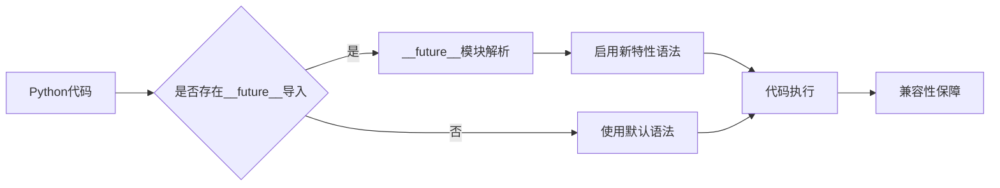

当如果在旧版本需要使用新版本的某些特性,比如说同时兼容py2和py3的话,就需要使用`__future__`**模块**.

该**模块**在2.1版本被引入.

官方文档链接:[官方链接][https://docs.python.org/3.9/library/__future__.html?highlight=__future__#module-__future__]

在官方文档里提到引入这个**模块**的三个**核心目的**.

> [`__future__`](https://docs.python.org/3.9/library/__future__.html?highlight=__future__#module-__future__) is a real module, and serves three purposes:
>
> * To avoid confusing existing tools that analyze import statements and expect to find the modules they’re importing.
> * To ensure that [future statements](https://docs.python.org/3.9/reference/simple_stmts.html#future) run under releases prior to 2.1 at least yield runtime exceptions (the import of [`__future__`](https://docs.python.org/3.9/library/__future__.html?highlight=__future__#module-__future__) will fail, because there was no module of that name prior to 2.1).
> * To document when incompatible changes were introduced, and when they will be — or were — made mandatory. This is a form of executable documentation, and can be inspected programmatically via importing [`__future__`](https://docs.python.org/3.9/library/__future__.html?highlight=__future__#module-__future__) and examining its contents.

简单翻译如下:

> 1.为了不影响现有的导入工具
>
> 2.为了保证低于2.1版本时报导入错误
>
> 3.记录何时引入了不可兼容的更改(可选性),何时将其设定成语言的特性(强制性)

为了更好地理解__future__模块的工作原理，我们可以通过以下流程图来可视化其工作机制：



---

在使用`__future__`**模块**后,即可使用新版本的**特性**.
比如在py2的环境中导入**print_function**,就可以在其环境中使用print()函数.

```python
# 导入__future__模块中的print_function特性
# 使得在Python 2环境中也能使用Python 3的print()函数语法
from __future__ import print_function

# 使用print()函数输出文本
print('hello,world')
```

详细的feature_name如下:

| feature          | optional in | mandatory in | effect                                                       |                   |
| :--------------- | :---------- | :----------- | :----------------------------------------------------------- | ----------------- |
| nested_scopes    | 2.1.0b1     | 2.2          | [**PEP 227**](https://www.python.org/dev/peps/pep-0227): *Statically Nested Scopes* |                   |
| generators       | 2.2.0a1     | 2.3          | [**PEP 255**](https://www.python.org/dev/peps/pep-0255): *Simple Generators* | 生成器            |
| division         | 2.2.0a2     | 3.0          | [**PEP 238**](https://www.python.org/dev/peps/pep-0238): *Changing the Division Operator* | 精确除法 3//4 = 0 |
| absolute_import  | 2.5.0a1     | 3.0          | [**PEP 328**](https://www.python.org/dev/peps/pep-0328): *Imports: Multi-Line and Absolute/Relative* | 绝对路径引用      |
| with_statement   | 2.5.0a1     | 2.6          | [**PEP 343**](https://www.python.org/dev/peps/pep-0343): *The “with” Statement* | with语句          |
| print_function   | 2.6.0a2     | 3.0          | [**PEP 3105**](https://www.python.org/dev/peps/pep-3105): *Make print a function* | print()函数       |
| unicode_literals | 2.6.0a2     | 3.0          | [**PEP 3112**](https://www.python.org/dev/peps/pep-3112): *Bytes literals in Python 3000* |                   |
| generator_stop   | 3.5.0b1     | 3.7          | [**PEP 479**](https://www.python.org/dev/peps/pep-0479): *StopIteration handling inside generators* |                   |
| annotations      | 3.7.0b1     | 3.10         | [**PEP 563**](https://www.python.org/dev/peps/pep-0563): *Postponed evaluation of annotations* |                   |

## 核心要点总结

1. **`__future__`模块的作用**：允许在旧版本Python中使用新版本的特性，实现向后兼容。

2. **引入目的**：避免影响现有导入工具、确保低版本报错以及记录不兼容更改的引入和强制时间。

3. **常用特性导入**：如print_function可在Python 2中使用Python 3的print()函数语法。

4. **关键特性列表**：nested_scopes、generators、division、absolute_import、with_statement、print_function等。

5. **版本兼容性**：每个特性都有其可选版本和强制版本，需要根据目标环境选择合适的特性导入。

6. **实际应用场景**：主要用于Python 2到Python 3的迁移过程中，确保代码在两个版本间的兼容性。

