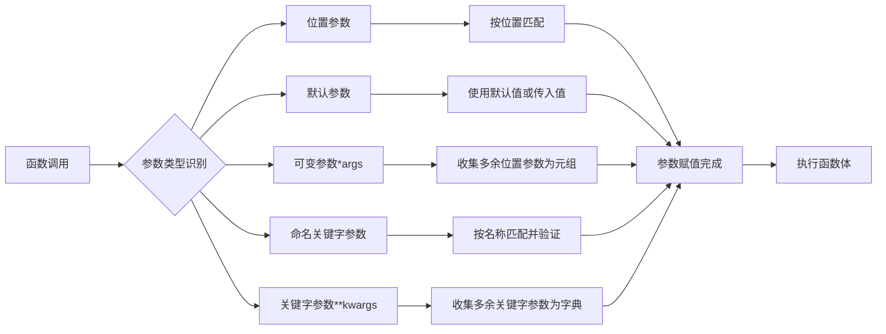

# 默认参数

## 默认参数定义

```python
# 先定义一个简单的平方函数，计算x的平方
def power(x):
    return x*x

>>>power(5)  # 调用函数计算5的平方
25

# 扩展这个函数，使其可以计算x的n次方
# x: 底数
# n: 指数
def power(x,n):
    s = 1  # 初始化结果变量为1
    # 循环n次，每次将s乘以x
    while n > 0:
        n = n - 1  # 指数减1
        s = s * x  # 结果乘以底数
    return s  # 返回最终结果

>>>power(5,3)  # 调用函数计算5的3次方
125
```

但是这时候再调用第一个函数,则会报错.


即,调用函数 power()缺少了一个位置参数 n.

这时候就需要使用**默认参数**了

```python
# 使用默认参数定义函数，n的默认值为2
# x: 底数（必选参数）
# n: 指数（可选参数，默认值为2）
def power(x,n=2):
    s = 1  # 初始化结果变量为1
    # 循环n次，每次将s乘以x
    while n > 0:
        n = n - 1  # 指数减1
        s = s * x  # 结果乘以底数
    return s  # 返回最终结果

#如果需要使用 n不等于2的情况,则需要明确传入 n 值.
#必选参数在前,默认参数在后,否则可能会报错.
#当函数有多个函数时,把变化比较大的参数放在前面,变化比较小的放后面.
#变化小的参数可以作为默认参数,这样可以降低调用的难度以及优化代码
```

多个默认参数,有时按照顺序提供默认参数,有时可以不按顺序提供默认参数

```python
#顺序传参方式调用函数
enroll('Bo','M',7)
#关键字参数方式调用函数，提高代码可读性
enroll('Ad','M',city='Tianjin')
```

## 默认参数坑

```python
# 错误示例：使用可变对象作为默认参数
# L: 列表参数，默认值为空列表（这里是有问题的！）
def add_end(L=[]):
    L.append('END')  # 向列表末尾添加'END'元素
    return L  # 返回修改后的列表
    
>>> add_end()  # 第一次调用
['END']
>>> add_end()  # 第二次调用，结果不是预期的['END']而是['END', 'END']
['END', 'END']
```

函数定义的是在某个列后加入一个 'END', 但是函数好像每次都*记住了*上次添加了' END'后的 list.

原因如下:

Python函数在定义的时候,**默认函数L**的值就被确定了,因为 **默认函数 L** 也是一个变量,它指向对象[],每次调用该函数时,如果改变了 **L** 的内容,则下次调用时,默认参数的内容就发生了变化,不再是默认的定义.

故,需要特别注意!!

**默认参数必须指向不变对象!!**

```
可变对象:list,dict,set
不变对象: str,None,tuple
```

# 可变参数

可变参数是指传入的参数个数是可变的.

## list法

```python
# 可以通过传入一个 list 作为函数的参数,从而实现参数个数可变.
# numbers: 包含数字的列表
def calc(numbers):
    sum = 0  # 初始化总和为0
    # 遍历列表中的每个数字，计算平方和
    for n in numbers:
        sum = sum + n * n  # 累加每个数字的平方
    return sum  # 返回计算结果
# 但是必须先填入一个 list 或 tuple
>>>calc([1,2,3])  # 计算1²+2²+3²=1+4+9=14
14
```

每次必须传入一个 list 或者 tuple, 太繁琐.

##加*

所以一般将函数的参数改为可变参数

```python
# 使用可变参数定义函数，可以接收任意数量的位置参数
# *numbers: 可变参数，接收任意数量的位置参数，函数内部作为元组处理
def calc(*numbers):
    sum = 0  # 初始化总和为0
    # 遍历所有传入的参数，计算平方和
    for n in numbers:
        sum = sum + n * n  # 累加每个数字的平方
    return sum  # 返回计算结果
```

在参数前加一个*号.

在内部流程中,参数 numbers 接收到的是一个**tuple**.

```python
>>>calc(1,2)  # 直接传入两个参数1和2，计算1²+2²=1+4=5
5
```

如果要传入一个 list 或 tuple, 则可以选择在 list 或 tuple 前加一个*号,把 list 或 tuple的元素变成可变参数传入:

```python
>>>nums=[1,2,3]  # 定义一个包含数字的列表
>>>calc(*nums)  # 使用*解包列表，将列表元素作为单独参数传入函数
14
```

# 关键字参数

## 关键字参数的设置

可变参数允许传入任意**个数**参数,自动组装成一个 **tuple**.

关键字参数允许传入任意个数**含参数名**的参数,自动组装成一个 **dict**.

```python
# 定义带有关键字参数的函数
# name: 姓名（必选参数）
# age: 年龄（必选参数）
# **kw: 关键字参数，接收任意数量的键值对参数，函数内部作为字典处理
def person(name,age,**kw):
    print(name,age,kw)  # 打印姓名、年龄和其他关键字参数

>>>person('Bo',5,city='Beijing')  # 传入姓名、年龄和城市信息
Bo 5 {'city': 'Beijing'}
```

在 person 函数里,我们能保证收到两个必须参数*name*和*age*,如果调用者需要提供更多信息,我们也可以收到这些信息,而且这些信息可以是任意的.

也可以先做一个 dict 来存储这些**额外**的信息,

```python
>>>extra={'city':'Beijing','job':'Engineer','location':'changping'}  # 定义一个包含额外信息的字典
##可以对个别 key 值调用
>>>person('Ja',24,city=extra['city'])  # 只传入city信息
##也可以一次性全部调用
>>>person('Ja',23,**extra)  # 使用**解包字典，将字典的所有键值对作为关键字参数传入
```

** extra 表示把 extra 这个 dict 的所有 key-value 用关键字参数传入到函数的 *\* kw 参数, kw 获得一个 dict, 这里并不是指针改变,而是拷贝,所以 kw 的后续改动并不会影响到函数外的 extra.

## 命名关键字参数

### 关键字参数检查

因为在传入时并没有规定参数的格式,所以传入的信息会比较杂乱,

有时希望**检查**某些参数是否输入:

```python
# 对关键字参数进行检查的函数
# name: 姓名（必选参数）
# age: 年龄（必选参数）
# **kw: 关键字参数
def person(name,age,**kw):
    # 检查是否传入了city参数
    if 'city' in kw:
        pass  # 实际应用中可以在这里处理city参数
    # 检查是否传入了job参数
    if 'job' in kw:
        pass  # 实际应用中可以在这里处理job参数
    print('name:',name,'age:',age,'other:',kw)  # 打印所有参数
```

但传入的信息还是很杂乱,

### 关键字参数限制

有时希望**限制**关键字参数的名字:

```python
# 使用命名关键字参数限制参数名称
# name: 姓名（位置参数）
# age: 年龄（位置参数）
# city: 城市（命名关键字参数）
# job: 工作（命名关键字参数）
def person(name,age,*,city,job):
    print(name,age,city,job)  # 打印所有参数
```

***后面的参数都将被视为命名关键字参数.**

**如果有了一个可变参数,则可变参数后面的参数默认为命名关键字参数**

```python
# 混合使用可变参数和命名关键字参数
# name: 姓名（位置参数）
# age: 年龄（位置参数）
# *args: 可变参数，接收额外的位置参数
# city: 城市（命名关键字参数）
# job: 工作（命名关键字参数）
def person(name,age,*args,city,job):
    print(name,age,args,city,job)  # 打印所有参数
```

### 关键字参数的一些问题

* 命名关键字参数必须传入参数名.

  (因为它本质上是一个 dict, 与 key有关,与位置无关)

* 命名关键字可以设置缺省值

```python
# 命名关键字参数可以设置默认值
# name: 姓名（位置参数）
# age: 年龄（位置参数）
# city: 城市（命名关键字参数，默认值为'Beijing'）
# job: 工作（命名关键字参数）
def person(name,age,*,city='Beijing',job):
```

* 注意区分位置参数和命名关键字参数,命名关键字参数实质是传入了一个 dict, 与位置无关.

# 参数组合

## 参数顺序

参数定义是一定要按照以下顺序

**必选参数,默认参数,可变参数,命名关键字参数,关键字参数**

比如

```python
# 参数组合示例1：包含所有类型的参数
# a, b: 位置参数
# c: 默认参数（默认值为0）
# *args: 可变参数
# **kw: 关键字参数
def f1(a,b,c=0,*args,**kw):

# 参数组合示例2：包含命名关键字参数
# a, b: 位置参数
# c: 默认参数（默认值为0）
# d: 命名关键字参数
# **kw: 关键字参数
def f2(a,b,c=0,*,d,**kw):
```

```python
>>> f1(1, 2)  # 只传入必选参数
a = 1 b = 2 c = 0 args = () kw = {}
>>> f1(1, 2, c=3)  # 传入必选参数和默认参数
a = 1 b = 2 c = 3 args = () kw = {}
>>> f1(1, 2, 3, 'a', 'b')  # 传入必选参数、默认参数和可变参数
a = 1 b = 2 c = 3 args = ('a', 'b') kw = {}
>>> f1(1, 2, 3, 'a', 'b', x=99)  # 传入所有类型的参数
a = 1 b = 2 c = 3 args = ('a', 'b') kw = {'x': 99}
>>> f2(1, 2, d=99, ext=None)  # 调用第二个函数
a = 1 b = 2 c = 0 d = 99 kw = {'ext': None}
```

## 通过list,tuple 和 dict 传入

```
>>> args = (1, 2, 3, 4)  # 定义一个元组
>>> kw = {'d': 99, 'x': '#'}  # 定义一个字典
>>> f1(*args, **kw)  # 使用*和**解包元组和字典作为参数传入
a = 1 b = 2 c = 3 args = (4,) kw = {'d': 99, 'x': '#'}
>>> args = (1, 2, 3)  # 定义另一个元组
>>> kw = {'d': 88, 'x': '#'}  # 定义另一个字典
>>> f2(*args, **kw)  # 使用*和**解包元组和字典作为参数传入
a = 1 b = 2 c = 3 d = 88 kw = {'x': '#'}
```

# 总结

Python的函数具有非常灵活的参数形态，既可以实现简单的调用，又可以传入非常复杂的参数。

**默认参数必须指向不变对象**，如果是可变对象，程序运行时会有逻辑错误！

要注意定义可变参数和关键字参数的语法：

`*args`是**可变参数**，args接收的是一个tuple；

`**kw`是**关键字参数**，kw接收的是一个dict。

以及调用函数时如何传入可变参数和关键字参数的语法：

可变参数既可以直接传入：`func(1, 2, 3)`，又可以先组装list或tuple，再通过`*args`传入：`func(*(1, 2, 3))`；

关键字参数既可以直接传入：`func(a=1, b=2)`，又可以先组装dict，再通过`**kw`传入：`func(**{'a': 1, 'b': 2})`。

使用`*args`和`**kw`是Python的习惯写法，当然也可以用其他参数名，但最好使用习惯用法。这是**Python参数传递的最佳实践**。

命名的关键字参数是为了限制调用者可以传入的参数名，同时可以提供默认值。

定义命名的关键字参数在没有可变参数的情况下不要忘了写分隔符`*`，否则定义的将是位置参数。

# Python函数参数处理流程

为了更好地理解Python函数参数的处理机制，我们可以用以下图表来展示不同类型参数的处理流程：



# 参数组合规则

Python函数参数遵循严格的定义顺序，下面的图表展示了正确的参数排列规则：

```mermaid
graph TB
    A[参数定义顺序] --> B[必选参数]
    A --> C[默认参数]
    A --> D[可变参数*args]
    A --> E[命名关键字参数]
    A --> F[关键字参数**kwargs]
    B --> G[例如: def func(a, b)]
    C --> H[例如: def func(a, b=2)]
    D --> I[例如: def func(a, b=2, *args)]
    E --> J[例如: def func(a, b=2, *args, c, d)]
    F --> K[例如: def func(a, b=2, *args, c, d, **kwargs)]
```

# 核心要点总结

1. **默认参数必须指向不变对象**：使用可变对象作为默认参数会导致意外的行为，因为默认参数在函数定义时只被计算一次。

2. **可变参数的使用**：通过在参数前添加`*`号，可以接收任意数量的位置参数，函数内部将其作为一个tuple处理。

3. **关键字参数的灵活性**：使用`**kw`可以接收任意数量的键值对参数，函数内部将其作为一个dict处理。

4. **命名关键字参数的限制作用**：通过`*`分隔符或在可变参数后定义参数，可以限制调用者只能传入指定名称的参数。

5. **参数定义顺序的重要性**：参数必须按照**必选参数,默认参数,可变参数,命名关键字参数,关键字参数**的顺序定义。

6. **参数传递的最佳实践**：使用`*args`和`**kw`是Python的习惯写法，便于代码的可读性和一致性。