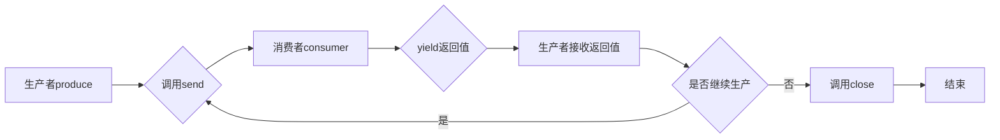

## 协程是什么猫?

**协程**(coroutinr),微线程.一个线程执行.

**进程**是分配和管理资源的最小单位.

**线程**是分配和管理CPU的最小单位,和其他同属一个进程的线程共享所拥有的全部资源.

和多线程相比,**协程**的优势在于:

1.**极高的执行效率**.因为子程序切换由程序自身控制,不是线程切换.没有切换线程带来的开销. 线程数越多,协程性能优势比多线程更明显.

2.**不需要多线程的锁机制**,不存在同时写变量冲突,共享资源不加锁,判断状态就好了.

协程可以通过**多进程+协程**的方法你用多核CPU.

### **yield**可以实现协程

当一个函数中存在**yield**时,这个函数就是一个**生成器**.

**yield**的两个特点: 1.返回一个值,保存现场.   2.将调用者的参数传入生成器.

这使得**yield**实现的生成器具有`中断等待`的功能,从而实现协程.

### yield实现协程的例子

```python
def consumer():
    r = ''  # 初始化返回值为空字符串
    while True:  # 无限循环，持续消费生产者发送的数据
        n = yield r  # 初始化后,中断在yield r。使用send方法传入数据后，yield返回该数据
        if not n:  # 如果接收到的数据为空，则退出循环
            return
        print('[消费者] 正在消费:{0}'.format(n))  # 打印正在消费的数据
        r = '200 人民币'  # 设置返回值为'200 人民币'

def produce(c):  # 生产者函数
    c.send(None)  # 启动消费者(生成器),进行初始化
    n = 0  # 初始化计数器
    while n < 5:  # 循环5次生产数据
        n = n + 1  # 计数器加1
        print('[生产者] 正在生产:{0}'.format(n))  # 打印正在生产的商品编号
        r = c.send(n)  # 调用send方法,将商品编号传入消费者协程,同时接收消费者返回的结果
        print('[生产者] 消费者返回:{0}'.format(r))  # 打印消费者返回的结果
        print('-------------------------------------------------')
    c.close()  # 关闭消费者生成器

c = consumer()  # 构造一个消费者生成器
produce(c)  # 启动生产者
```

## 协程的状态查看

**GEN_CREATED**:等待执行, 还没有进入协程.

**GEN_RUNNING**:解释器执行

**GEN_SUSPENDED**:阻塞状态,在yield处暂停

**GEN_CLOSED**:执行结束

可以通过inspect.getgeneratorstate()函数来确定.

为了更直观地理解yield实现的协程工作原理，我们可以用下面的流程图来表示生产者-消费者模型的执行过程：



### yield实现协程的不足

每次只能向直接调用者返回一个值.导致无法分离到一个单独的函数中.**复用性差**.

---

## **yield from**

- Python3.3版本的PEP 380中添加了`**yield from**`语法，允许一个`**generator**`生成器将其部分操作委派给另一个生成器。其产生的主要动力在于使生成器能够很容易分为多个拥有**send**和**throw**方法的子生成器，像一个大函数可以分为多个子函数一样简单。Python的生成器是**协程**`coroutine`的一种形式，但它的局限性在于只能向它的直接调用者**yield**值。这意味着那些包含**yield**的代码不能想其他代码那样被分离出来放到一个单独的函数中。这也正是`**yield from**`要解决的。
- 虽然`**yield from**`主要设计用来向**子生成器**委派操作任务，但`**yield from**`可以向任意的迭代器委派操作；

**yield**只能返回一个元素,而**yield from** 可以返回一个生成器.

在PEP 380 使用了一些yield from使用的专门术语：

**委派生成器：**包含 yield from <iterable> 表达式的生成器函数；

**子生成器：**从 yield from 表达式中 <iterable> 部分获取的生成器；

**调用方：**调用委派生成器的客户端代码；即上面的main生成器函数


委派生成器在 yield from 表达式处暂停时，调用方可以直接把数据发给子生成器，子生成器再把结果直接发回给调用方。子生成器返回之后，解释器会抛出StopIteration 异常，并把返回值附加到异常对象上，此时委派生成器会恢复

```Python
yield from list #等效于 for item in list:
                           yield item
```

### yield from所实现的数据传输通道

## 核心要点总结

1. **协程**是一种轻量级的并发编程方式，相比多线程具有更高的执行效率和更低的资源消耗。

2. **yield**关键字可以让函数变成生成器，实现基本的协程功能，通过send()方法在生产者和消费者之间传递数据。

3. **yield from**是yield的增强语法，能够委派操作给子生成器，解决了yield复用性差的问题。

4. 协程有四种状态：**GEN_CREATED**（等待执行）、**GEN_RUNNING**（正在执行）、**GEN_SUSPENDED**（暂停状态）和**GEN_CLOSED**（执行结束）。

5. 协程的主要优势包括：**极高的执行效率**、**无需多线程锁机制**以及可以结合多进程利用多核CPU。

6. 通过**inspect.getgeneratorstate()**函数可以查看协程的当前状态。

