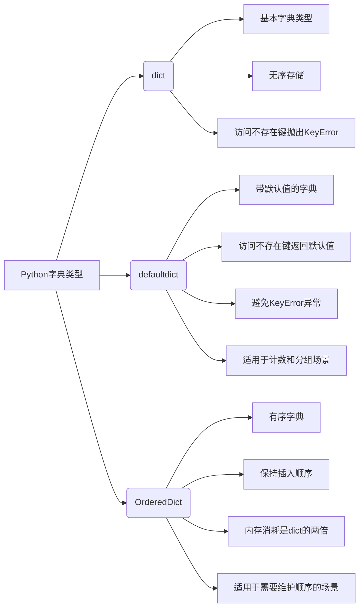

# Python字典详解：dict、defaultdict与OrderedDict

Python中字典的基础就是**哈希表**。

下面的图表展示了三种字典类型的特性和使用场景：



## 字典的基本操作

### 1. 访问字典元素
```python
dic['key']        # 直接通过键访问字典元素，如果键不存在会抛出KeyError异常
dic.get('key')    # 通过get方法访问字典元素，即使键不存在也不会抛出异常，而是返回None
```

### 2. 删除字典元素
```python
dic.pop('key')  # 修复语法错误：原为 dic.pop['key']
# 使用pop方法删除指定键的元素，并返回该键对应的值
```

### 3. 增加字典元素
```python
dic['key'] = value  # 通过赋值的方式向字典中添加新的键值对
```

### 4. 遍历字典
```python
# 遍历key
for key in dic.keys():  # 获取字典的所有键并遍历
    pass

# 遍历value
for value in dic.values():  # 获取字典的所有值并遍历
    pass

# 遍历项
for item in dic.items():  # 获取字典的所有键值对并遍历，每个项是一个元组(key, value)
    pass

# 遍历key和value
for key, value in dic.items():  # 同时获取字典的键和值进行遍历
    pass
```

### 5. 其他常用操作
```python
# in判断
'key' in dic           # 判断指定键是否存在于字典中
'value' in dic.values()  # 判断指定值是否存在于字典的值中

# 更新字典
dic.update({'key': 'value'})  # 修复：原为 dic.update('key')
# 使用update方法将另一个字典的键值对添加到当前字典中

# 浅拷贝
dic2 = dic.copy()  # 创建字典的一个浅拷贝副本

# 设置默认值
dic.setdefault('key', default=None)
# **setdefault方法**虽然可以设置默认值,但一次只能设置一个key的默认value,
# 更好的解决方案是**defaultdict**
strings = ('puppy', 'kitten', 'puppy', 'puppy',
           'weasel', 'puppy', 'kitten', 'puppy')
counts = {}
for kw in strings:
    # 如果键kw不存在，则设置默认值0，然后加1；如果存在则直接加1
    counts[kw] = counts.setdefault(kw, 0) + 1
```
## 字典合并

在实际开发中，我们经常需要将两个或多个字典合并。以下是几种常见的字典合并方法：

```python
a = {'a': 3, 'b': 4}  # 定义第一个字典
b = {'c': 5}          # 定义第二个字典

# 方法1：使用dict构造函数和关键字参数展开
# 注意：这种方法只适用于字符串键且是有效的Python标识符
result1 = dict(a, **b)  # 将字典a和字典b合并为新字典

# 方法2：使用update方法（会修改原字典，相同键会被覆盖）
a.update(b)  # 将字典b的内容更新到字典a中，直接修改字典a
print(a)  # {'a': 3, 'b': 4, 'c': 5}

# 方法3：使用for循环逐个添加键值对
a = {'a': 3, 'b': 4}  # 重置a
for k, v in b.items():  # 遍历字典b的每个键值对
    a[k] = v  # 将字典b的键值对添加到字典a中
print(a)  # {'a': 3, 'b': 4, 'c': 5}
```

## 字典创建

创建字典有多种方式，以下是一些常用的方法：

```python
# 方法1：直接使用花括号
dict1 = {'one': 1, 'two': 2, 'three': 3}  # 直接通过花括号创建字典

# 方法2：使用dict构造函数和关键字参数
dict2 = dict(one=1, two=2, three=3)  # 通过关键字参数创建字典

# 方法3：使用zip函数组合两个列表
list1 = ['one', 'two', 'three']  # 定义键列表
list2 = [1, 2, 3]                # 定义值列表
dict3 = dict(zip(list1, list2))  # 使用zip函数将两个列表组合成字典

# 方法4：使用已有字典和关键字参数
dict4 = dict({'one': 1, 'three': 3}, two=2)  # 基于现有字典并添加新的键值对
```
## 默认值字典（defaultdict）

在使用普通字典时，如果访问一个不存在的键，会抛出 **KeyError** 异常。为了避免这种情况，我们可以使用 **defaultdict**。

**defaultdict** 的作用在于，当字典里的键不存在但被查找时，不是返回 KeyError，而是返回一个默认值。

```python
from collections import defaultdict

# 创建不同类型的defaultdict
a = defaultdict(int)      # 默认值为0，适用于计数场景
b = defaultdict(str)      # 默认值为空字符串
c = defaultdict(dict)     # 默认值为空字典
d = defaultdict(set)      # 默认值为空集合

print(a[0])  # 访问不存在的键0，返回默认值0
print(b[1])  # 访问不存在的键1，返回默认值空字符串
print(c[2])  # 访问不存在的键2，返回默认值空字典{}
print(d[3])  # 访问不存在的键3，返回默认值空集合set()
```

从上面的例子可以看出，defaultdict 会对所有不存在的键返回相应的默认值。

1. 使用 list 参数创建列表字典

```python
from collections import defaultdict

# 将K-V对序列转换为列表字典
a = defaultdict(list)  # 创建一个默认值为空列表的defaultdict
s = [('a', 1), ('a', 3), ('v', 3)]  # 定义键值对序列
for k, v in s:  # 遍历键值对序列
    a[k].append(v)  # 将值v添加到键k对应的列表中
print(a)
```

输出：
```
defaultdict(<class 'list'>, {'a': [1, 3], 'v': [3]})
```

2. 使用 int 参数创建计数器

```python
from collections import defaultdict

# 用作计数器
a = defaultdict(int)  # 创建一个默认值为0的defaultdict，适合用作计数器
s = 'apple'           # 定义字符串
for k in s:           # 遍历字符串中的每个字符
    a[k] += 1         # 对每个字符出现次数进行累加计数
print(a)
```

输出：
```
defaultdict(<class 'int'>, {'a': 1, 'p': 2, 'l': 1, 'e': 1})
```

3. 使用 set 参数创建集合字典

```python
from collections import defaultdict

# 用作集合字典
s = [('red', 1), ('blue', 2), ('red', 3), ('blue', 4), ('red', 1), ('blue', 4)]
# 定义键值对序列，其中包含重复的键值对
d = defaultdict(set)  # 创建一个默认值为空集合的defaultdict
for k, v in s:       # 遍历键值对序列
    d[k].add(v)      # 将值v添加到键k对应的集合中，自动去重
print(d)
a = sorted(d.items())  # 对字典项进行排序
print(a)
```

输出：
```
defaultdict(<class 'set'>, {'red': {1, 3}, 'blue': {2, 4}})
[('blue', {2, 4}), ('red', {1, 3})]
```

4. 使用自定义函数作为默认值工厂

我们可以使用不带参数的可调用对象，它会返回该函数的返回结果作为默认值。

```python
from collections import defaultdict

def default_func():
    return '默认值'  # 自定义默认值函数，返回固定字符串

df = defaultdict(default_func)  # 使用自定义函数作为默认值工厂
print(df['32'])  # 访问不存在的键'32'，将调用default_func函数返回'默认值'
```

更简洁的方式是使用 lambda 函数来定义简单的默认值函数：

```python
from collections import defaultdict

df = defaultdict(lambda: 0)      # 使用lambda函数定义默认值为0
ds = defaultdict(lambda: 'apple')  # 使用lambda函数定义默认值为'apple'
print(df['32'])  # 输出：0，访问不存在的键'32'，返回默认值0
print(ds['2'])   # 输出：apple，访问不存在的键'2'，返回默认值'apple'
```


## 有序字典（OrderedDict）

**dict** 和 **defaultdict** 都是无序的，而 **OrderedDict** 是有序的。

在 **OrderedDict** 内部维护着一个根据键插入顺序排列的双向链表，每当有新元素插入时，会被放到链表的尾部。

**OrderedDict** 的大小是普通 dict 的两倍，所以需要权衡顺序和额外的内存消耗。

```python
from collections import OrderedDict

d = OrderedDict()  # 创建一个有序字典

# move_to_end 方法
d.move_to_end('key')           # 将键为'key'的元素移到末尾
d.move_to_end('key', last=False)  # 将键为'key'的元素移到开头

# popitem 方法
d.popitem(last=True)           # 删除并返回最后一个键值对
d.popitem(last=False)          # 删除并返回第一个键值对

# 排序操作
# 按照 key 排序
sorted_items = sorted(d.items(), key=lambda i: i[0])  # 按键进行排序

# 按照 value 排序
sorted_items = sorted(d.items(), key=lambda i: i[1])  # 按值进行排序
```


## dict、defaultdict、OrderedDict 比较

| 功能/方法 | dict | defaultdict | OrderedDict | 作用说明 |
|----------|------|-------------|-------------|----------|
| d.__copy__ |  | √ |  | 用于支持 copy.copy |
| d.default_factory |  | √ |  | 在 __missing__ 函数中被调用的函数，用来给未找到的元素初始化 |
| d.__missing__ |  | √ |  | 当 __getitem__ 找不到对应键的时候，该方法会被调用 |
| d.move_to_end(k, last=True) |  |  | √ | 把键为 k 的元素移动到最后或最前 |
| d.__reversed__() |  |  | √ | 返回倒序的键的迭代器 |
| d.popitem() | √ | √ | √ | dict 和 defaultdict 是随机移除，而 OrderedDict 是移除最先插入的元素 |

## 核心要点总结

1. **哈希表原理**：Python字典基于哈希表实现，提供了高效的键值对存储和查找功能。

2. **defaultdict的使用**：相比普通字典，defaultdict可以在访问不存在的键时自动创建默认值，避免KeyError异常，特别适用于计数、分组等场景。

3. **OrderedDict特性**：OrderedDict保持了键值对的插入顺序，在需要维护元素顺序的场景下非常有用，但内存消耗是普通字典的两倍。

4. **字典操作方法**：掌握字典的基本操作如访问、增删、遍历、更新等方法，以及setdefault等高级用法，能有效提高代码效率。

5. **字典合并技巧**：了解多种字典合并方法，包括dict构造函数、update方法和循环添加等方式，可以根据具体需求选择最适合的方法。

6. **字典创建方式**：熟悉多种字典创建方式，包括直接定义、构造函数、zip函数组合等，能够灵活应对不同的创建需求。

参考资料：
[理解 Python 语言中的 defaultdict-团子的小窝](https://kodango.com/understand-defaultdict-in-python)

[三种字典的比较-biu嘟](https://www.cnblogs.com/lyq-biu/p/10756957.html)