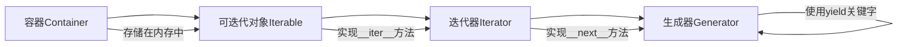

理一理可迭代对象,迭代器,生成器之间的联系.


---

## 概念关系图



## 容器Container

1.**容器**是一个存储多个元素的数据结构.

2.容器中的元素可以通过迭代获取.

3.所有容器中的元素被存放在内存中.

4.常见的容器比如 list,tuple,dict,set,str.也都是**可迭代对象**(Iterable)

```python
from collections import Iterable
a = ['test','test2']  # 创建一个包含两个字符串元素的列表
for i in a: # 通过for循环迭代获取列表中的每个元素
  print(i)  # 打印当前元素
isinstance(a,Iterable) # 检查列表a是否为可迭代对象，返回True
```

---

## 可迭代对象Iterable

**可迭代对象**是可以通过被迭代获取的对象.

内部定义了可返回迭代器的\__iter__()方法.

比如:

```python
x = [1, 2, 3]  # 创建一个包含三个整数的列表
for elem in x:  # 遍历列表中的每个元素
  print(elem)   # 打印当前元素
```

x列表是一个可迭代对象,在for循环中调用iter()方法变成迭代器,遍历x实际上是调用elem=next(x).

---

## 迭代器Iterator

**迭代器**是一个**带状态**的对象,该状态用于记录当前迭代所在位置,以方便下次迭代的时候获取正确的元素.

Iterator实现了`__iter__`和`__next__`方法.

迭代器不会一次性把所有的元素都加载到内存,而是**在需要的时候才会生成返回结果**.

1.可迭代对象!=迭代器.

2.迭代器带状态.

3.迭代器不会直接加载到内存.

---

## 生成器generator

**生成器**是一种特殊的迭代器.

生成器可以**传入数据**进行计算,并根据变量内容计算结果后返回.

使用send方法传入数据.

### 生成器函数generator func

含有yield关键字的函数就是生成器函数.

```python
def d():
    print('第一次调用')
    sum = 0
    # 第一次c.send(None)只执行到 yield sum
    # 再次进入时执行 value = yield sum,将yield 赋值给sum,然后赋值给value
    value = yield sum
    sum = value + sum
    print('sum的值为:%d' %sum)
    print('value%d' %value) # 输出value1
    # c.send(1)只执行到yield sum, 再次进入时执行 value = 2
    value = yield sum
    print('value%d' %value) # 输出value2
    yield sum
    

c = d()  # 创建生成器对象，此时函数并未执行
d = c.send(None)  # 启动生成器，执行到第一个yield，返回sum的值并赋值给d
print('生成器传出的值为%d' % d)
d = c.send(1)  # 传入数值1，通过yield传递给value，继续执行到第二个yield
print('第二次调用返回值为%d' % d)
d = c.send(2)  # 传入数值2，继续执行到第三个yield
print('第三次调用返回值为%d' % d)
```

可以看到,yield将sum的值传递给了`调用方`,将send()方法递进来的`1`传递给了`value`.

保存了迭代器的状态.

### 生成器表达式generator expression

生成器表达式是列表生成式的生成器版本.返回一个生成器对象.

```python
from collections import Iterator
a = (x*x for x in range(10))  # 创建一个生成器表达式，计算0-9的平方
print(isinstance(a,Iterator))   # 检查a是否为迭代器对象，返回True
for x in a:                    # 遍历生成器中的每个值
  print(x)                     # 打印当前值
```

### 生成器的优势

延迟加载:在处理长序列问题时,更加节省存储空间.

比如打印一个斐波那契数列,原始方法如下:

```python
def fab(max):
    n, a, b = 0, 0, 1   # 初始化计数器n和斐波那契数列的前两个数a,b
    L = []               # 创建空列表存储斐波那契数列
    while n < max:       # 当计数器小于最大值时继续循环
        L.append(b)      # 将当前斐波那契数添加到列表中
        a, b = b, a + b  # 计算下一个斐波那契数
        n += 1           # 计数器加1
    return L             # 返回完整的斐波那契数列
print(fab(20))          # 打印前20个斐波那契数
```

所有元素都存放在列表L里,空间开销较大.

使用生成器的方法如下:

```python
def fab(max):
    n, a, b = 0, 0, 1     # 初始化计数器n和斐波那契数列的前两个数a,b
    while n < max:         # 当计数器小于最大值时继续循环
        yield b            # 每次在这里中断, 把b的值传递给i, 同时保存中断时的状态
        a, b = b, a + b    # 计算下一个斐波那契数
        n += 1             # 计数器加1
for i in fab(20):          # 使用生成器遍历前20个斐波那契数
    print(i)               # 打印当前斐波那契数
```

这种方法不需要额外的列表空间开销.

### send()方法是交互的

```python
def my_generator(n):
    for i in range(n):     # 循环n次
        yield i            # 依次产出0到n-1的数字
g = my_generator(5)        # 创建生成器对象，可产出0-4的数字
print(next(g))             # 获取下一个值，输出0
print(next(g))             # 获取下一个值，输出1
print(g.send(100))         # 发送数据100，但仍然返回下一个值2
print(next(g))             # 获取下一个值，输出3
print(next(g))             # 获取下一个值，输出4
```

可以看到第7行的g.send()方法输出了本来next()方法应该输出2.

1.send()的主要作用是当需要手动更改生成器里面的某一个值并且使用它，则发送进去一个数据保存到yield语句的返回值，以提供后续使用.

2.send()的返回值就是那个本来应该被迭代出来的那个值。这样既可以保证能够传入新的值，原来的值也不会弄丢.


---

总结

| 对象      | 特点                                                         | 功能              |
| --------- | ------------------------------------------------------------ | ----------------- |
| iterable  | 实现了`__iter__()`方法                                       | 返回一个iterator  |
| iterator  | 实现了`__iter__()`和`__next__()`方法.<br />数据需要时才会存储到内存中 | 逐个传出数据      |
| generator | yield替换了`__next__()`方法,可以中断,<br />保存了`状态`的迭代器 | 逐个传入/传出数据 |
| container | 元素都存储在内存中<br />元素可以通过迭代获取                 |

## 核心要点总结

1. **容器(Container)**：存储多个元素的数据结构，所有元素都被存放在内存中，常见的容器包括list、tuple、dict、set、str等。

2. **可迭代对象(Iterable)**：可通过迭代获取的对象，内部定义了可返回迭代器的`__iter__()`方法。

3. **迭代器(Iterator)**：带状态的对象，实现了`__iter__()`和`__next__()`方法，不会一次性加载所有元素到内存，在需要时才会生成返回结果。

4. **生成器(Generator)**：一种特殊的迭代器，使用yield关键字，可以中断并保存状态，支持传入数据进行计算。

5. **生成器函数**：包含yield关键字的函数，每次调用会返回一个生成器对象。

6. **生成器表达式**：列表生成式的生成器版本，返回一个生成器对象，具有延迟加载的特性。

7. **send()方法**：用于向生成器传入数据并获取下一个值，实现生成器与调用方的数据交互。                   |

