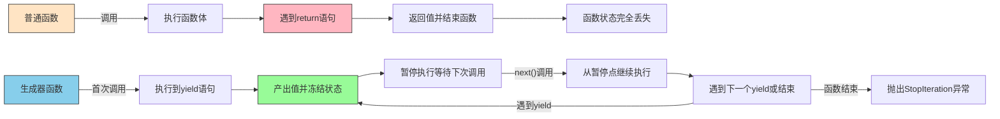

# 深入理解Python生成器：高效内存管理的利器
生成器可以动态的生成后续的元素,

是一种基于某种算法推算出来的, 因为在需要时才生成,故使用**生成器**可以节省大量的空间.

在 Python 中,这种一边循环一边计算的机制,称为**生成器**: **generator**.

## 创建 generator

### []改()

只要将一个列表生成式的`[]`改成`()`,就创建了一个 **generator**:

```python
>>>L=[x*x for x in range(10)]  # 创建一个列表推导式，生成0到9的平方数列表
>>>L
[0,1,4,9,16,25,36,49,64,81]
>>>g=(x*x for x in range(10))  # 将列表推导式的方括号改为圆括号，创建生成器
>>>g
<generator object <genexpr> at 0x1022ef630>
```

L 是 一个 list, g 是 一个 **generator**.

通过 next()函数,可以获得 **generator** 的下一个返回值.

**即,按照设定的算法生成了后续序列**

一般来说,是使用 for 循环来迭代 **generator**.

```python
>>>g=(x*x for x in range(10))  # 创建一个生成器对象
>>>for n in g:  # 使用for循环迭代生成器
       print(n)  # 逐个打印生成器产生的值
```

## yield

有些函数也可以通过算法实现自增,

但是这种函数只是有了'**自我生成算法**',还缺少一个非常重要的标志'**yield**'.

yield 取代 return, 为函数返回值.

如果一个函数定义包含关键字 **yield**, 那么这个函数就不再是一个普通的函数,而是一个 **generator**.

## yield 与 return 的区别

当一个**生成器函数**调用 **yield**, **生成器函数**的'**状态**'会被**冻结**,所有的变量的值会被保留下来,下一行要执行的代码的位置也会被记录,知道再次调用 next().一旦 next() 再次被调用,**生成器函数**会从它上次离开的地方开始.

下面通过一个简单的流程图来展示生成器函数的工作原理：

```mermaid
graph TD
    A[调用生成器函数] --> B[执行到yield语句]
    B --> C[产出值并冻结状态]
    C --> D[下次调用next()]
    D --> E[从上次停止位置继续执行]
    E --> F{是否还有yield语句?}
    F -->|是| B
    F -->|否| G[函数结束抛出StopIteration]
```

为了更好地理解生成器与普通函数的区别，我们可以通过下面的对比图来说明：



# 总结

* **generator** 是用来产生一系列的值的.
* **yield** 向 **generator** 函数返回结果
* **yield** 唯一做的另一件事就是保存一个 **generator** 的状态
* **generator** 是特殊类型的**迭代器**
* 可以通过 **next()**来获取 **generator** 的下一个值
* 可以通过隐私调用 **next()**来忽略某些值.


# 例子

**杨辉三角**问题

1. 每个数等于它上方两数之和。

2. 每行数字左右对称，由1开始逐渐变大

   下面是我的代码:

   ```python
   def triangles():
       n = 0  # 初始化行号计数器
       while True:  # 无限循环生成杨辉三角
           if n==0:  # 处理第一行，只有一个元素1
               L2=[1]
               yield L2  # 产出第一行
           elif n==1:  # 处理第二行，有两个元素1
               L2=[1,1]
               yield L2  # 产出第二行
           else:  # 处理后续行
               L=L2.copy()  # 复制上一行数据，避免引用问题
               i = 0
               while i < n-1:  # 计算中间的数值
                   L2[i+1]=L[i]+L[i+1]  # 当前位置的值等于上一行相邻两数之和
                   i=i+1
               L2.append(1)  # 每行末尾添加1
               yield L2  # 产出当前行
           n += 1  # 行号递增

   # 使用示例
   n = 0
   for t in triangles():  # 迭代生成器函数
       print(t)  # 打印每一行
       n = n + 1
       if n == 10:  # 控制只输出前10行
           break
   ```

   在代码中,还有一个值得注意的地方.

   `L=L2`是**软复制**,仅仅是指针指向.

   如果不希望两个 list 之间的变动相互干扰,就需要使用 `L.copy()`方法来实现**硬复制**.

   另外,我的代码表现出很浓的 C 风格.

   以下是看到的其他同学的实践方法,值得学习:

   ```python
   def triangles():
       L = [1]  # 初始化第一行
       while True:  # 无限循环，持续生成下一行
           yield L  # 产出当前行
           L.append(0)  # 在列表末尾添加0，便于计算
           # 通过列表推导式生成下一行：每个元素等于当前位置和前一个位置元素之和
           L = [L[i - 1] + L[i] for i in range(len(L))]
   ```

   还有另一种写法:

   ```python
   def triangles():
       ret = [1]  # 初始化第一行
       pre = ret[:]  # 复制当前行作为下一次计算的基准
       while True:  # 无限循环，持续生成下一行
           yield ret  # 产出当前行
           for i in range(1, len(ret)):  # 从第二个元素开始计算
               ret[i] = pre[i] + pre[i - 1]  # 当前位置值等于上一行相邻两数之和
           ret.append(1)  # 行尾添加1
           pre = ret[:]  # 复制当前行作为下一次计算的基准
   ```

   ​

# 核心要点总结

1. **生成器**(generator)是一种**惰性计算**机制，按需生成数据，节省内存空间，特别适用于处理大量数据或无限序列的场景
2. **yield**关键字是**生成器函数**的核心标识，用于产出值并保存函数状态，与return不同，yield不会终止函数执行，而是暂停并保存状态
3. **生成器**是特殊的**迭代器**，支持**next()**函数逐个获取值，可以通过**for循环迭代生成器**来遍历所有值
4. 有两种创建**生成器**的方式：通过列表推导式将方括号`[]`改为圆括号`()`创建简单生成器对象；通过在函数中使用**yield**关键字创建**生成器函数**
5. **生成器函数**在每次调用next()时从上次暂停的位置继续执行，这种特性使得生成器能够保存执行状态并在需要时恢复
6. 使用**for循环迭代生成器**是最佳实践，避免手动调用next()可能引发的StopIteration异常

