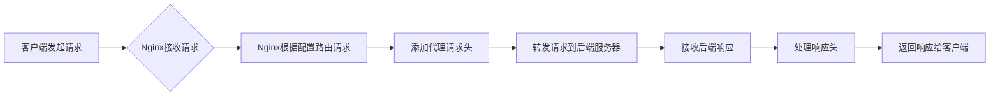

## **静态资源配置**

配置语法- **sendfile**

```nginx
# sendfile 配置语法
# Syntax: sendfile on | off;  # 是否启用 sendfile
# Default: sendfile off;      # 默认关闭
# Context: server,location,if in location  # 可配置上下文
Syntax: sendfile on | off;
Default: sendfile off;
Context: server,location,if in location
```


配置语法- **tcp-nopush**

```nginx
# tcp_nopush 配置语法
# Syntax: tcp_nopush on | off;  # 是否启用 tcp_nopush
# Default: tcp_push off;        # 默认关闭
# Context: http,server,location  # 可配置上下文
# 在 sendfile 开启的情况下, 提高网络包的传递效率
Syntax: tcp_nopush on | off
Default: tcp_push off;
Context: http,server,location
```

不着急推送,而是将多个 tcp 打包进行集中发送,以提升效率.适合大文件

配置语法- **tcp-nodelay**

```nginx
# tcp_nodelay 配置语法
# Syntax: tcp_nodelay on | off;  # 是否启用 tcp_nodelay
# Default: tcp_nodelay on;       # 默认开启
# Context: http,server,location   # 可配置上下文
# 在 keepalive 连接下,提高网络包的传递实时性
Syntax: tcp_nodelay on | off
Default: tcp_nodelay on;
Context: http,server,location
```

配置语法-**压缩**

```nginx
# gzip 压缩等级设置
# Syntax: gzip_comp_level level;  # 设置压缩级别 (1-9)
# Default: gzip_comp_level 1;     # 默认压缩级别为1
# Context: http,server,location    # 可配置上下文
Syntax: gzip_comp_level level;
Default: gzip_comp_level 1;
Context: http,server,location
```

扩展 Nginx 压缩模块

__`http_gzip_static_module`__-预读 gzip 功能. 

__`http_gunzip_module`__-应用支持 gunzip 的压缩功能. (很少用到)

gzip 对文本的压缩很好,对图片的压缩一般.

```Shell

```

## **浏览器缓存**

**HTTP 协议定义的缓存机制**(如 Expires,Cache-control等)

校验过期机制

| 校验是否过期                                   | Expires(http1.0),Cache-Control(http1.1) (max-age定义一个周期) |
| ---------------------------------------------- | ------------------------------------------------------------ |
| 如果 max-age 显示已经过期,则会检查后面两个校验 |                                                              |
| 协议中 Etag头信息校验                          | Etag(保存一个字符串,来识别缓存,类似"别名")                   |
| Last-Modified 头信息校验                       | Last-Modified(保存一个时间,精确到秒,如果两个时间不一致,则服务器会传递一份新的) |

Max-age<=0时,就要求每次请求都会要求服务器检查是否过期.即使服务器端设置了 max-age, 但是浏览器为了实时更新,会将 request里 max-age 设置为0.


静态资源配置场景设置

配置语法-expires

```nginx
# expires 缓存配置示例
location / {
    # 设置资源缓存时间为24小时
    expires  24h;
}
```

## **跨域访问**

为什么浏览器禁止跨域访问?

不安全,容易出现 CSRF 攻击.

nginx 怎么做?

```nginx
# add_header 配置语法
# Syntax: add_header name value [always];  # 添加响应头
# Default: -                               # 默认无
# Context: http,server,location,if in location  # 可配置上下文
Syntax: add_header name value [always];
Default: - 
Context: http,server,location,if in location
```

如果服务器允许跨域访问,则浏览器不会禁止. 通过检查Access-Control-Allow-Origin 头来确定是否允许.

```nginx
# 跨域访问配置示例
location ~ .*\.(htm|html)$ {
    # 允许来自 http://www.qq.com 的跨域请求
    add_header Access-Control-Allow-Origin http://www.qq.com;
    # 允许的请求方法
    add_header Access-Control-Allow-Methods GET,POST,PUT,DELETE,OPTIONS;
}
```

如果将 域名替换成*,则会对 CSRF 攻击完全开放.

## **防盗链**

简单防盗链实现.

防盗链设置思路.

首要方式:区别哪些请求是非正常的用户请求

基于 **http_refer** 防盗链配置模块

```nginx
# 防盗链配置示例
# valid_referers表示允许哪些referer信息访问 
# none表示允许没有带referer的信息过来    
# blocked表示允许被防火墙屏蔽的referer
# ip 只允许这个ip的referer过来访问.
valid_referers none blocked ip ;
# 如果referer无效，则返回403错误
if($invalid_referer){
    return 403;
}
```

__'referer'__是告诉服务器这个请求是从哪个页面链接过来的.

如果直接访问页面,则在 access.log 里面为 "-".

进阶解决方案:

后期补充


## **代理服务**

**正向代理**

> 客户端—代理—|— 服务端

**反向代理**

> 客户端—|—代理—服务端

区别在于代理的对象不一样.

正向代理代理的对象是客户端.

反向代理代理的对象是服务端.

#### **配置语法**

```nginx
# proxy_pass 配置语法
# Syntax: proxy_pass URL;  # 设置代理目标地址
# Default: -             # 默认无
# Context: location,if in location,limit_except  # 可配置上下文
# 示例: http://ip:80/url/
Syntax: proxy_pass URL;
Default: -
Context: location,if in location,limit_except
```

服务器 A (10.211.55.15)  服务器 B(10.211.55.16)

服务器A,

```nginx
# 限制访问IP示例
location / {
    # 如果请求来源IP不是指定的服务器B IP，则拒绝访问
    if($http_x_forwarded_for !~*"^10\.211\.55\.16"){
        return 403;
    }
}
```

这样设置后,所有不是来自服务器 B 的访问,都会被返回403.

服务器 B,

```nginx
# 反向代理配置示例
location /{
    # 将请求转发到目标服务器
    proxy_pass $http_host$request_uri;
}
```

注意 uri 和 url 是不同的.

uri 统一资源标志符, url 统一资源定位符.

一个用于解析,一个用于直接传递路径.

其他语法配置

**proxy_buffering** 缓冲区

**proxy_redirect** 跳转重定向

**proxy_set_header** 头信息 ,扩展 proxy_hide_header,proxy_set_body

**proxy_connect_timeout**  超时 ,扩展 proxy_read_timeout,proxy_send_timeout


### proxy 常用配置

```nginx
# 代理服务完整配置示例
location / {
    # 设置代理目标地址
    proxy_pass http://127.0.0.1:8080;
    # 设置重定向行为
    proxy_redirect default;

    # 设置请求头信息
    proxy_set_header Host $http_host;
    proxy_set_header X-Real-IP $remote_addr;

    # 设置连接超时时间(秒)
    proxy_connect_timeout 30;
    # 设置发送超时时间(秒)
    proxy_send_timeout 60;
    # 设置接收超时时间(秒)
    proxy_read_timeout 60;

    # 设置代理缓冲区大小
    proxy_buffer_size 32k;
    # 启用代理缓冲
    proxy_buffering on;
    # 设置缓冲区数量和大小
    proxy_buffers 4 128k;
    # 设置繁忙缓冲区大小
    proxy_busy_buffers_size 256k;
    # 设置临时文件最大大小
    proxy_max_temp_file_size 256k;
}
```

如果有多个 proxy 方案,则可以使用

```nginx
# 引用外部配置文件示例
location / {
    # 包含外部代理参数配置文件
    include proxy_params;
}
```

然后把配置放在文件里.


## 核心要点总结

- **静态资源配置优化**：通过sendfile、tcp_nopush和tcp_nodelay等配置提升文件传输效率，其中sendfile用于零拷贝传输，tcp_nopush用于打包发送，tcp_nodelay用于提高实时性

- **HTTP缓存机制**：利用Expires和Cache-Control控制缓存周期，结合ETag和Last-Modified进行缓存校验，实现高效的浏览器缓存策略

- **跨域访问控制**：通过add_header指令设置Access-Control-Allow-Origin等响应头，实现安全的跨域资源共享(CORS)机制

- **防盗链机制**：基于http_refer配置valid_referers指令，有效防止其他网站盗用本站资源，保护服务器带宽

- **代理服务配置**：区分正向代理和反向代理的应用场景，通过proxy_pass等指令实现请求转发和负载均衡

- **代理参数调优**：合理配置proxy_buffering、proxy_connect_timeout等参数，优化代理服务的性能和稳定性


## Nginx代理请求处理流程

下面的图表展示了Nginx作为反向代理时的请求处理流程：


